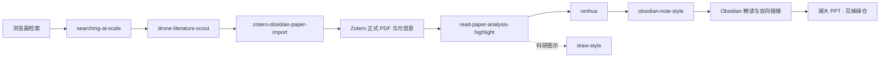

# Unified-Scholarflow-Skills

多 Agent 通用的科研检索、文献管理、精读笔记、科研绘图与 Skill 治理工作流。

Agent-agnostic research skills for literature discovery, reading notes, scientific figures, and skill governance.

**版本 v1.1** · 姊妹仓库：[academic-native-ppt-design-HNU-style](https://github.com/w5711112/academic-native-ppt-design-HNU-style)（湖大风格学术 PPT）

---

## 这套东西解决什么问题

科研里真正费时间的，往往不是“想明白一个问题”，而是卡在环节交接上：

- 论文搜到了，版本对不对、PDF 全不全、有没有归档，还要再查一遍；
- 读完了，笔记散在浏览器、文件夹和几个软件里，下次找不到依据；
- 组会前又要压文字、换图、改版式，同类操作反复做。

本仓库把这些反复出现的操作写成可执行规则，让 Agent 按固定步骤推进：检索 → 核验 → 导入 → 精读 → 组织笔记 → 画图 → 发布治理。每一步都有明确输入、输出和停下来核对的条件。

它不是下载后免配置的成品。检索主题、来源白名单、路径和写作偏好需要按自己的方向改。下列配置大量体现维护者的个人习惯；**克隆后可以改成自己的笔记与检索习惯**，不改也能跑通主流程，只是示例领域味道更重。

本次公开版不含数学建模相关 Skill。标 ★ 的是人工调优较多的部分。

---

## 整套体系长什么样

下图是全局地图：左边是写作与生态治理，右边是从文献发现到图形产出的研究主链。先看这张图建立位置感，后面再按环节看效果。


*图 1 · 全体系协作地图（也展示了 draw-style 的成图风格）。治理侧负责规则、发布与故障复用；研究侧负责“这篇论文从哪来、是否可靠、写了什么、如何复用”。*

---

## 核心工作流（先看链路，再看单点效果）



一句话概括：**先把“是哪一篇、版本可不可信”钉死，再读全文提证据，再把表达理顺，最后放进可检索的知识网络。**

---

## 重点效果：论文精读与 Zotero–Obsidian 双向联动

这是整条链里最常用、也最能省事的一段。论文正式 PDF、元信息、Zotero 原生高亮和 Obsidian 结构化笔记放在同一条证据链上；从笔记能跳回 PDF 对应位置，从 Zotero 也能回到笔记。


*图 2 · `read-paper-analysis-highlight` + `zotero-obsidian-paper-import` 的联动效果（重点图，保留 v1.0 同款）。左侧是论文与批注，右侧是笔记层级与跳转；重点不是逐句翻译，而是把问题、方法、技术路线、证据和局限放到能复用的位置。*

补充两张同一链路的细节：


*图 3 · `zotero-obsidian-paper-import`：在 Obsidian 点链接，直接回到 Zotero 阅读位置。*


*图 4 · `zotero-obsidian-paper-import`：在 Zotero 侧也能回到对应笔记段落。*

### 精读时具体在抓什么

`read-paper-analysis-highlight` 会逐页看正文、公式和图，再把“作者到底解决了什么、证据到哪一步”写清楚。它要求结论能指回原文位置，避免只凭摘要或常识发挥。


*图 5 · `read-paper-analysis-highlight`：导入前核对论文身份与 PDF，避免“以为读了、其实文件不对”。*


*图 6 · `read-paper-analysis-highlight`：关键引用单独标注，方便顺着参考文献往前追。*


*图 7 · `read-paper-analysis-highlight`：标题附近自动加一段通俗总览，方便日后回忆这篇在讲什么。图中只对论文标题局部打码（版权考虑），作者与期刊信息仍可辨认。*

---

## 知识组织：obsidian-note-style

读完之后，内容要放进自己能检索、能展开的笔记结构里。`obsidian-note-style` 负责层级、折叠、高亮配色和双向链接，让多篇论文并列时不糊成一团。


*图 8 · `obsidian-note-style`：笔记按问题—方法—证据分层，可折叠；正文仍可编辑，不是截图。*


*图 9 · `obsidian-note-style`：用颜色区分“论文原述 / 自己推断 / 待核验”，减少以后误把自己的猜想当成原文结论。*


*图 10 · `obsidian-note-style`：概念之间用双向链接串起来，从一篇论文能走到相关方法与前置知识。*

---

## 科研绘图：draw-style

画图不是“好看就行”。`draw-style` 先问这张图要证明什么关系，再选图型、定颜色语义和字号，最后检查文字是否被裁切、图例是否和数据对得上。


*图 11 · `draw-style`：方法/对比类示意图，线型与颜色承担固定含义。*


*图 12 · `draw-style`：同一信息换一种版式时，语义编码保持不变。*


*图 13 · `draw-style`：把“先学什么、再学什么”画成层次，而不是平铺概念堆。*

---

## 广域检索：searching-at-scale

需要跨站点尽量搜全时，用 `searching-at-scale`。它记录发现—筛选轨迹和耗时，而不是只扔回一堆没核对的链接。


*图 14 · `searching-at-scale`：一次调研的发现与筛选过程。图中调研主题关键字已遮盖；结构、来源链和耗时统计保留，用来说明轨迹怎么记。*

文献质量与“值不值得进研究证据链”则由 `drone-literature-scout` 接手：优先正式来源和高可信发表渠道，搜索摘要不当论文事实。示例主题用无人机方向说明流程；其他领域请换成自己的主题词与来源范围。

---

## 故障复用：collect-bug-update-accelerate

真实技术故障会被记成事件，归入问题族；已经验证过的处理路线可以复用，避免下次原样再踩一遍。


*图 15 · `collect-bug-update-accelerate`：失败时留下可复用的问题记录，而不是只剩一条报错。*

---

## 学术 PPT：见姊妹仓 HNU-style

旧的通用 `academic-native-ppt-design` 和 `codex-ppt` 已从本仓库撤下。演示文稿以湖南大学风格的原生可编辑系统为准：

| 封面感 | 中间页 | 收束感 |
| --- | --- | --- |
|  |  |  |

*图 16 · `academic-native-ppt-design-HNU-style` 预览。完整 10 张大图、规则与脚本见 [academic-native-ppt-design-HNU-style](https://github.com/w5711112/academic-native-ppt-design-HNU-style)。*

---

## 为什么做成 Skill / Plugin

一次问答通常以一段文字结束。科研任务还要读文件、调浏览器和 Zotero、写笔记，并证明结果可用。把这些步骤写成 Skill，Agent 才能：

1. 知道这一步输入什么、输出什么；
2. 知道什么时候必须停下来给人判断；
3. 下次同类任务直接复用，而不是从提示词重新猜。

Plugin 则把一组常一起用的 Skill、脚本和配置装成一个包。可以只装单个 Skill，也可以保留整个插件目录，让检索、导入、精读按固定关系配合。

---

## 几条有代表性的规则（说人话版）

完整条文在各 `SKILL.md` 与 `references/`。这里只挑几条好理解的，说明“规则到底在管什么”。

### renhua：中文怎样写得自然，又不弄丢事实

- **破折号（——）和分号基本不用。** 能并成一句就并，该断开就改句号。读起来更像人在说事，而不是在堆从句。
- **长句短句错开。** 连续好几句长度差不多会显得机械；该拆就拆，该合就合，但不为了“有节奏”乱加口头语。
- **只改说法，不改事实。** 人名、数字、时间、术语、引号里的原话、“可能 / 通常 / 显著”这类限定词，改写前后强度必须一样。“可能提升”不能写成“提升”。
- **删掉空话和表演腔。** “综上所述”“必将大放异彩”“让我来为你解释”这类句子直接去掉或落回具体事实。工作文档里有依据的“应 / 须 / 严禁”保留力度，不故意说软。

### read-paper / zotero-import：先钉死“是哪一篇”

- **搜索摘要不是论文。** 标题、作者、DOI、正式版本对上了，才允许写入 Zotero。
- **PDF 要真的打开看过。** 页数、图表、公式位置要对得上；文件不对就停，不硬读。
- **每条结论能指回原文。** 方法、实验、局限都标位置，方便以后复查，也方便顺着参考文献往前追。

### searching-at-scale / Edge 桥：浏览器怎么安全地用

- **扩展权限压到最小。** 只申请检索相关站点；不用远程调试接口，不模拟键鼠。
- **专用配置与日常 Edge 分开。** 独立 profile 和独立管道，避免和你正在用的浏览器抢会话。
- **MiMo Desktop 等宿主可直接接管。** 公共脚本 `edge_bridge_ctl.py` 负责安装 Native Host、启动 Edge、探测管道；不必改代码换宿主。

### draw-style：图先服务证据

- **先问这张图证明什么。** 比较、层次、流程还是分布？选错图型，后面配色再好也没用。
- **同一含义同一编码。** 线型、颜色、图例一旦约定，全文不换着玩。
- **字号和留白要能读。** 投影距离上的可读性，比“塞满”更重要。

### HNU PPT（姊妹仓）：版式怎样稳定

- **先选版式，再填内容。** 大图页、对照页、高密要点页各有原型，避免每页从空白画布硬拖。
- **行距和字阶有固定档位。** 例如正文常用 16–18 pt，高密页 13–14.5 pt 并配合分栏；行距大约 18–20 pt，避免字粘在一起。
- **左下角印章区域留空。** 卡片避开水印与印章，不压线、不遮标志。
- **门禁脚本替你盯字阶和溢出。** `audit_hnu_deck.py` 查字号下限、出框和误粘贴的 Markdown 符号。

---

## 仓库结构

```text
Unified-Scholarflow-Skills/
├─ plugins/
│  ├─ skill-governance-plugin/          # 治理：注册、发布、迁移、故障复用
│  └─ drone-literature-scout-plugin/    # 研究主链：检索→导入→精读→笔记→绘图
├─ skills/
│  ├─ renhua/                           # 中文表达闸门
│  └─ skill-contract-lock/              # 多 Skill 时的要求与证据锁
├─ docs/images/                         # 本页效果图（已脱敏、已压缩）
└─ README.md
```

学术 PPT 请安装姊妹仓库；不要在本仓库找旧 PPT Skill。

### 各 Skill 一览

**研究主链（drone-literature-scout-plugin）**

| Skill | 做什么 |
| --- | --- |
| ★ searching-at-scale | 多入口较大规模检索，留下来源证据和停止说明；关键词与站点要自配。 |
| ★ drone-literature-scout | 按质量门槛筛文献，优先正式来源，避免把搜索摘要当结论。 |
| ★ zotero-obsidian-paper-import | 核对 DOI 与正式版本，写入 Zotero 父条目与附件，回填 Obsidian 跳转。 |
| ★ read-paper-analysis-highlight | 读全文与图表，提炼问题、方法、证据、局限，并生成可编辑高亮与笔记。 |
| ★ obsidian-note-style | 组织成可折叠、可编辑、可互链的 Obsidian 笔记。 |
| ★ draw-style | 为方法图、知识点图、数据图选型并检查版面。 |

**治理（skill-governance-plugin）**

| Skill | 做什么 |
| --- | --- |
| ★ collect-bug-update-accelerate | 记录真实故障，复用已验证的处理路线。 |
| github-upload | 做去隐私公开包，补 README 与依赖说明，再进入发布确认。 |
| migration-skill | 在 Codex、Claude Code、Kimi 等环境之间迁移 Skill。 |
| skill-ecosystem-governor | 维护注册表、依赖与版本一致。 |
| workspace-hygiene | 预演并可恢复地整理工作区。 |

**独立**

| Skill | 做什么 |
| --- | --- |
| ★ renhua | 中文人性化改写：去 AI 腔，保事实。 |
| skill-contract-lock | 多 Skill 协作时锁住原始要求与证据。 |

---

## 多宿主：Codex / Claude Code / Kimi / MiMo Desktop

Skill 以标准 `SKILL.md` + `references/` + `scripts/` 交付，不绑定单一聊天产品。**MiMo Desktop 与 Edge 的联动是实测通过的**，不是纸面兼容。

在 `searching-at-scale` 目录执行：

```powershell
python scripts\edge_bridge_ctl.py status
python scripts\edge_bridge_ctl.py install
$profile = Join-Path $env:TEMP 'mimo-scholarflow\edge-profile'
New-Item -ItemType Directory -Force -Path $profile | Out-Null
python scripts\edge_bridge_ctl.py launch --profile $profile --replace
python scripts\edge_bridge_ctl.py probe --profile $profile --timeout-ms 15000
```

`probe` 返回 `ok: true`，就表示当前 Agent（含 MiMo）已经走通：Agent → Edge 扩展 → Native Host → 命名管道。细节见  
`plugins/drone-literature-scout-plugin/skills/searching-at-scale/references/mimo-edge-integration.md`。

| 宿主 | 加载方式 | Edge |
| --- | --- | --- |
| Codex | Plugin 或技能目录 | 同一 `edge_bridge_ctl.py` |
| Claude Code | `.agents/skills` 等 | 同一命令 |
| Kimi Code | 技能目录 | 同一命令 |
| MiMo Desktop | 对话指定路径或技能目录 | 同一命令（已验证） |

---

## 使用前提

1. **Agent 宿主**（Codex / Claude Code / Kimi / MiMo Desktop 等）  
2. **Edge/Chromium**：装 `searching-at-scale/edge-extension/`，并执行 `edge_bridge_ctl.py install`  
3. **Zotero**：Connector + 允许本机通信；需要原生批注回链时再装 `integrations/zotero-local-bridge/`  
4. **Obsidian**：自己的 Vault 与论文索引，允许 `obsidian://`

常用依赖：Python 3、Node.js，以及 PyMuPDF、pypdf、PyYAML 等。以各目录 `REQUIREMENTS.md` / `package.json` 为准。

最小闭环：Obsidian 列出论文 → Agent 经 Edge 核验正式来源 → 合法 PDF 进 Zotero → 精读与原生高亮 → 写回 Obsidian → 两侧互跳。

## 安装

```powershell
git clone https://github.com/w5711112/Unified-Scholarflow-Skills.git
```

- 独立 Skill：整目录拷到技能路径，例如 `~/.agents/skills/<skill-name>/`，不要只拷 `SKILL.md`。  
- Plugin：保留整个 `plugins/<plugin-name>/` 再加载。  
- 首次运行前改配置：路径、主题、来源范围、时间预算、Zotero/Obsidian、扩展位置。  
- 治理注册表依赖本机路径，公开包不带维护者运行态锁，请在自己环境生成。

## 公开版边界

- 示例中的无人机方向只用于说明流程；其他领域请换主题词、来源范围、术语表和质量标准。  
- 不附带账号、密码、API key、真实本机绝对路径、私有 Vault、Zotero 数据库或未授权论文 PDF。  
- 自动下载只针对出版社、会议、机构仓储或作者明确提供的合法入口。  
- “哪些来源可信”依赖你的领域判断，通用默认值替代不了。  
- 效果图已做隐私处理：调研关键字遮盖、论文标题局部打码；方向/大组类截图未进入仓库。

## Related

- 学术 PPT（湖南大学风格，完整 10 图与规则）：[academic-native-ppt-design-HNU-style](https://github.com/w5711112/academic-native-ppt-design-HNU-style)

## 许可

代码与仓库自有文本按 [LICENSE](LICENSE) 使用。第三方组件见 [THIRD_PARTY_NOTICES.md](THIRD_PARTY_NOTICES.md)。安全问题见 [SECURITY.md](SECURITY.md)。

---

## English summary

**Unified-Scholarflow-Skills v1.1** is an agent-agnostic research workflow: large-scale web discovery, literature vetting, Zotero–Obsidian import, full-text reading with native highlights, note organization, scientific figures, Chinese prose cleanup (`renhua`), and skill governance.

Defaults encode one researcher’s habits and are meant to be edited.

Hosts include Codex, Claude Code, Kimi Code, and **MiMo Desktop**. Edge integration is verified end-to-end via `scripts/edge_bridge_ctl.py` (install native host → launch Edge → probe pipe).

Academic slides: [academic-native-ppt-design-HNU-style](https://github.com/w5711112/academic-native-ppt-design-HNU-style). Modeling skills are intentionally unpublished.
