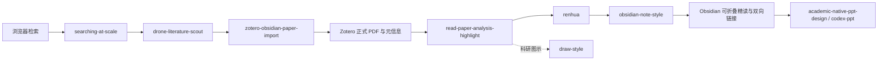
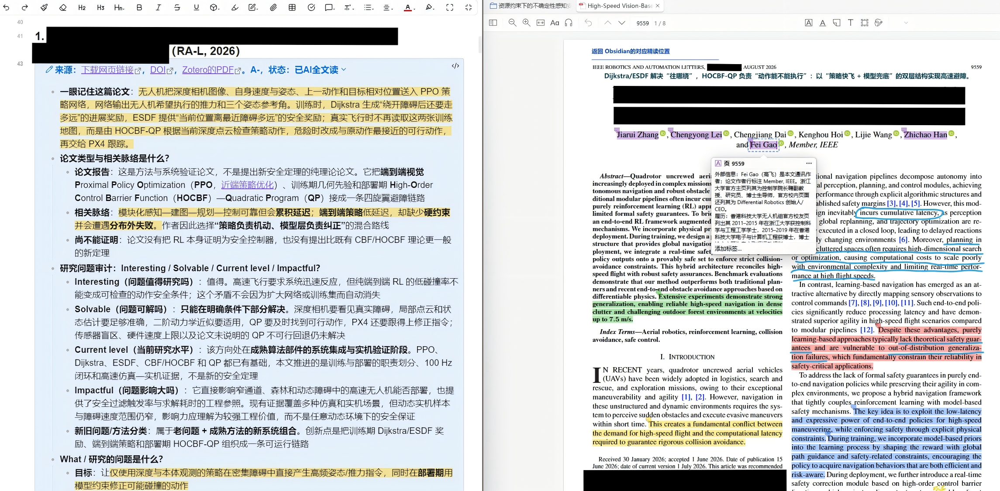
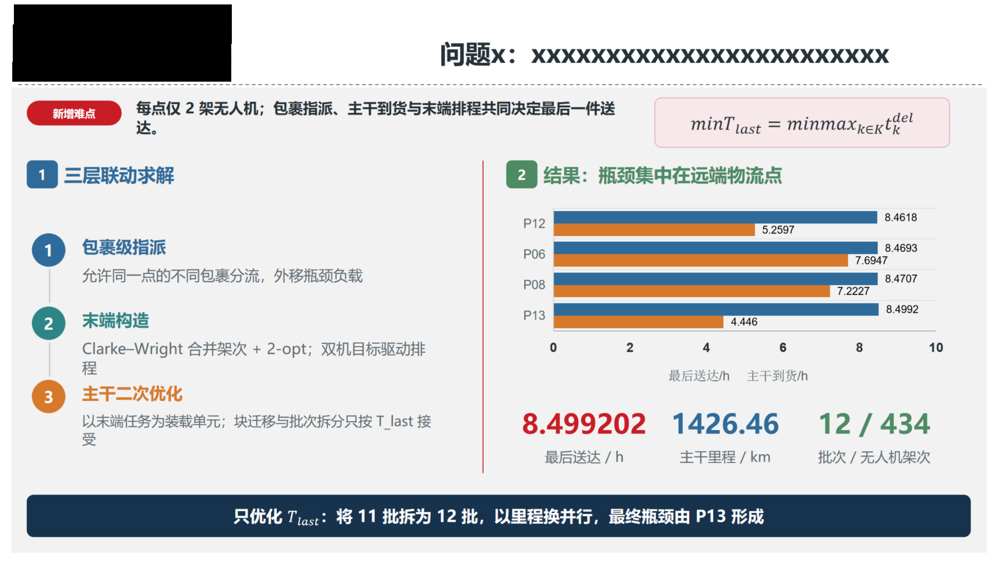
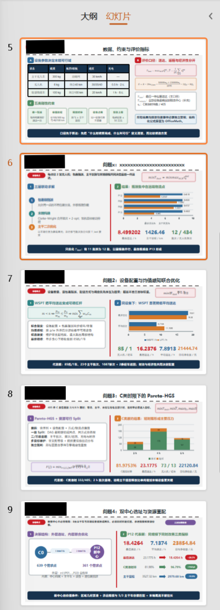

# Codex Research Skills

一套面向科研检索、论文管理、精读写作、科研绘图、学术汇报和 Skill 治理的 Codex 工作流。仓库保留完整架构与主要实现，但不是下载后即可无配置运行的成品：使用者需要按自己的研究方向补充检索主题、来源范围、路径、软件版本和个人写作偏好。

本次公开版不包含数学建模相关 Skill。标有 **★** 的项目，是并经过人工优化的 Skill；未标星项目仍属于完整体系的一部分，但非人工调优。

## 仓库结构

```text
codex-research-skills/
├─ plugins/
│  ├─ skill-governance-plugin/
│  │  └─ skills/
│  │     ├─ collect-bug-update-accelerate/
│  │     ├─ github-upload/
│  │     ├─ migration-skill/
│  │     ├─ skill-ecosystem-governor/
│  │     └─ workspace-hygiene/
│  └─ drone-literature-scout-plugin/
│     └─ skills/
│        ├─ draw-style/
│        ├─ drone-literature-scout/
│        ├─ obsidian-note-style/
│        ├─ read-paper-analysis-highlight/
│        ├─ searching-at-scale/
│        └─ zotero-obsidian-paper-import/
├─ skills/
│  ├─ academic-native-ppt-design/
│  ├─ codex-ppt/
│  ├─ renhua/
│  └─ skill-contract-lock/
└─ docs/examples/
```

这里的 **Plugin** 是一组能够协同工作的 Skill、脚本、配置和集成；**Skill** 则负责一个边界清楚的任务。可以只安装单个独立 Skill，也可以保留整个插件目录，让检索、导入、精读和治理能力按既定关系配合。

## 每个 Skill 做什么

### `drone-literature-scout-plugin`：科研阅读工作流

| Skill | 作用 |
|---|---|
| ★ `searching-at-scale` | 面向多个入口开展较大规模检索、收集候选结果并保留来源证据；公开版需要使用者自行填写研究关键词和站点范围。 |
| ★ `drone-literature-scout` | 在无人机主题示例上执行高质量文献发现与核验，优先正式来源、顶级期刊和高可信会议，避免把搜索摘要当成论文事实。 |
| ★ `zotero-obsidian-paper-import` | 从 Obsidian 论文清单核验 DOI 和正式版本，优先从论文官网取得合法 PDF，写入 Zotero 的父条目与存储附件，并回填可跳转链接。 |
| ★ `read-paper-analysis-highlight` | 逐页阅读论文正文、公式和图表，提炼问题、方法、技术路线、证据与局限，并生成可编辑的 Zotero 原生高亮和 Obsidian 精读笔记。 |
| ★ `obsidian-note-style` | 把研究内容整理为层级清楚、可折叠、可编辑、适合多论文并行阅读的 Obsidian 笔记，同时维护知识链接。 |
| ★ `draw-style` | 为论文方法图、知识点图和数据图选择合适的视觉结构，约束布局、配色、字体和证据表达，并进行成图检查。 |

### `skill-governance-plugin`：Skill 治理与发布

| Skill | 作用 |
|---|---|
| ★ `collect-bug-update-accelerate` | 记录真实技术故障、复用已经验证的解决路线，并避免原样重复失败操作。 |
| `github-upload` | 从本地 Skill 生成去隐私的公开副本，补齐 README 和依赖说明，审计后再进入 GitHub 发布确认。 |
| `migration-skill` | 在 Codex、Claude Code、Kimi Code 等环境之间迁移 Skill，并检查工具、路径和运行能力差异。 |
| `skill-ecosystem-governor` | 维护多 Skill 的注册表、依赖关系、聚合指南与版本一致性。 |
| `workspace-hygiene` | 检查工作区体积、旧版本和可再生产物，以预演和可恢复方式辅助清理。 |

### 独立 Skills

| Skill | 作用 |
|---|---|
| ★ `academic-native-ppt-design` | 生成或重构可原生编辑的学术 PPT，兼顾论证结构、页面布局、图表表达和交付检查。 |
| ★ `codex-ppt` | 从论文、笔记或提纲生成视觉统一的图像型 PPTX，适合快速形成完整演示稿。 |
| ★ `renhua` | 润色简体中文学术文字，清理对话残留和生硬的 AI 表达，同时保留术语、证据与正式程度。 |
| `skill-contract-lock` | 在多 Skill 协作中锁定原始要求与证据边界，防止摘要或派生计划替代权威规则。 |

## 核心工作流



它并不是把论文翻译一遍，而是把“论文从哪里来、版本是否可靠、PDF 是否完整、作者究竟解决了什么问题、方法如何推进、证据支持到哪里”拆开处理。遇到特别重要的问题，可以在单篇笔记中继续二次展开，不必让多论文汇总页失去可读性。

## 使用前提：浏览器、Zotero、Codex 与 Obsidian

完整联动需要四个桌面端组件：

1. **Codex**：加载本仓库中的 Skill 或 Plugin，并负责调用脚本、浏览器与本机工作流。
2. **浏览器（当前实现以 Edge/Chromium 为主）**：安装 `searching-at-scale/edge-extension/` 中的解压扩展；如启用原生通信，还需按 `native-host/README.md` 配置本机 host 路径。关键词、白名单和站点范围必须换成自己的研究配置。
3. **Zotero**：安装 Zotero Connector，开启“允许本机其他应用程序通信”；若需要原生批注与回到 Obsidian 的行为，还要安装 `plugins/drone-literature-scout-plugin/integrations/zotero-local-bridge/` 中的本地桥接扩展，并按其中 README 完成一次真实点击验证。
4. **Obsidian**：准备一个自己的 Vault 和论文索引 Markdown；允许 `obsidian://` 链接，并为论文条目保留稳定标题或 block ID。折叠显示依赖 Obsidian 原生 Callout 语法，无需把正文做成不可编辑图片。

最小闭环如下：在 Obsidian 列出待研究论文或主题 → Codex 经浏览器核验正式来源 → 从论文官网获取允许下载的 PDF 并写入 Zotero → 在 Zotero 中精读和生成原生高亮 → 把问题、方法、路线、证据和局限写回 Obsidian → 从两侧链接互相跳转。

常用运行依赖包括 Python 3、Node.js，以及 `PyMuPDF`、`pypdf`、`PyYAML` 等包。不同 Skill 的具体依赖以各目录内的 `REQUIREMENTS.md`、`package.json` 和 README 为准；请先核对包名与本机版本，再安装缺失项。

## 安装与配置

```powershell
git clone https://github.com/w5711112/codex-research-skills.git
```

- 独立 Skill：复制完整目录到自己的 Skill 搜索路径，例如 `~/.agents/skills/<skill-name>/`，不要只复制 `SKILL.md`。
- Plugin：保留整个 `plugins/<plugin-name>/`，包括 `.codex-plugin/plugin.json`、`skills/`、`scripts/`、`references/` 和 `integrations/`，再按当前 Codex 环境的插件加载方式安装。
- 首次运行前：复制或修改示例配置，将路径、研究主题、来源范围、时间预算、Zotero/Obsidian 设置和浏览器扩展位置改为自己的值。
- `skill-governance-plugin` 的生态注册表与锁文件依赖本机路径，公开包不携带维护者的运行态锁；请在自己的环境中配置或重新生成。

## 实际效果

### 论文精读与 Zotero–Obsidian 双向联动



上图集中展示了 `read-paper-analysis-highlight` 与 `zotero-obsidian-paper-import` 的协作效果：论文正式 PDF、元信息、原生高亮与结构化精读笔记被放在同一条证据链中；Obsidian 侧按问题、方法、技术路线和证据层级组织内容，并可在笔记与 Zotero 阅读位置之间跳转。重点不是逐句翻译，而是准确提取论文最值得复用的内容。


论文笔记可以直接展开或收起，正文与链接仍然保持可编辑。多篇论文并列时，读者先浏览统一层级；遇到关键方法、重要结论或尚未解决的问题，再单独展开二次分析。

### 学术 PPT：单页质量与多页一致性



这张单页图用于观察一页成品的具体效果：信息主次、文字密度、图文关系、留白和配色需要共同服务于学术论证，而不是简单套用模板。

<p align="center">
  
</p>

多页纵向预览用于观察整套演示中的变化与统一：不同页面可以采用不同的内容组织和版式，但布局仍要稳定，颜色关系保持协调，让风格具有多样性而不显得杂乱。

> 四张效果图均由维护者人工脱敏并明确授权原样公开；仓库未对图片进行裁剪、压缩或二次加工。

## 公开版边界

- 示例中的无人机方向用于说明完整工作流；其他领域应自行替换主题词、权威来源范围、术语表和质量标准。
- 仓库不会附带个人账号、密码、API key、真实本机绝对路径、私有 Vault、Zotero 数据库或未授权论文 PDF。
- 自动下载只应针对出版社、会议、机构仓储或作者明确提供的合法全文入口；无法确认许可时只保留元信息与来源链接。
- 高质量检索依赖使用者对“什么来源可信、哪些会议或期刊属于本领域核心范围”的配置，通用默认值不能替代领域判断。

## 许可与第三方组件

代码与仓库自有文本按 [LICENSE](LICENSE) 使用。浏览器、Zotero、Obsidian 及其他第三方组件仍受各自许可约束，详见 [THIRD_PARTY_NOTICES.md](THIRD_PARTY_NOTICES.md)。安全问题与敏感信息处理方式见 [SECURITY.md](SECURITY.md)。
