# Unified-Scholarflow-Skills

**多 Agent 通用**的科研检索、文献管理、精读笔记、科研绘图与 Skill 治理工作流。

Agent-agnostic research skills for literature discovery, reading notes, scientific figures, and skill governance.

**版本 v1.1** · 姊妹仓库：[academic-native-ppt-design-HNU-style](https://github.com/w5711112/academic-native-ppt-design-HNU-style)

---

## 1. 解决什么问题

科研时间大量耗在**环节交接**上。本仓库把反复出现的操作写成**可执行规则**，由 Agent **按固定步骤自动推进**，并在软件里留下**看得见、点得动、可复核**的结果。

| 实际卡点 | 体系自动交付的结果 |
| --- | --- |
| 对话里搜文献一轮只有几条，来回补搜 | **searching-at-scale**：一轮铺开大量候选链接与结构化记录 |
| 搜到的是 arXiv 稿或摘要，正式版没落库 | **zotero-obsidian-paper-import**：Zotero 里出现**正式 PDF + 完整附件** |
| 打开 PDF 人工划线，划完就忘为什么划 | **read-paper-analysis-highlight**：PDF 上留**彩色高亮与批注框**，写着理解而不是译文 |
| 笔记结构每篇都不一样，找不到前置知识 | **obsidian-note-style**：Obsidian 里是**可折叠分层笔记 + 双向链接** |
| 术语一上来就是 HOCBF-QP，没有 CBF 铺垫 | 自动补**基础知识点页**并建跳转，从简单定义递进读上去 |
| 图「好看」但说不清证明什么 | **draw-style**：先出直观图，需要时再落到公式层 |
| 中文被改得像 AI 腔，或把「可能」写成「肯定」 | **renhua**：表达变顺，事实强度不变 |

使用前需配置**检索主题、来源范围、路径和写作偏好**。默认配置带有维护者个人习惯，可按需修改。

---

## 2. 整套体系一张图

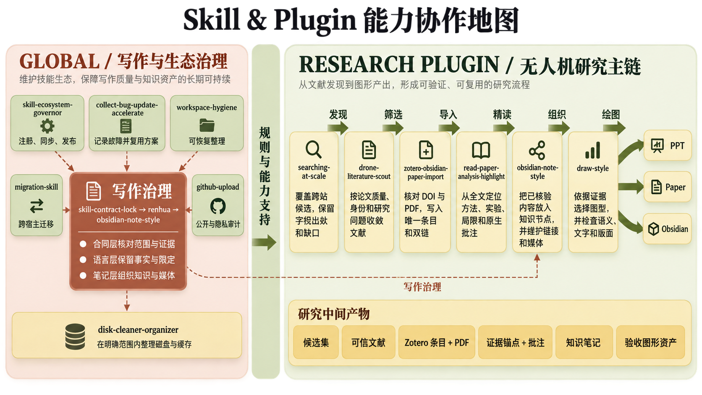

> **图 1 · 全体系协作地图（原图，同时展示 draw-style 成图风格）。**
> 左侧**写作与生态治理**，右侧**检索 → 筛选 → 导入 → 精读 → 组织 → 绘图**。每一步交出的是**下一步能直接用的文件或链接**，不是一段口头总结。

---

## 3. 核心链路

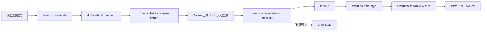

> **链路含义：** 先**搜够候选**并钉死**正式版本**，再在 PDF 上**精读并留下标注**，在 Obsidian 里**汇总成可展开笔记**并补全前置概念，最后可出图、出汇报。

---

## 4. 重点效果

### 4.1 论文精读与 Zotero–Obsidian 双向联动

**zotero-obsidian-paper-import 自动做三件事**

1. **自动核对身份并导入正确的文献版本**  
   【对照 DOI、正式出版页与文件内容，**优先采用期刊 / 会议的正式版本**与合法 PDF，而不是把 arXiv 预印本、搜索摘要或转载页当成最终版本。身份对不上就停下，不硬写库。】

2. **自动写入 Zotero**  
   【在文献管理软件 **Zotero** 中生成父条目与**存储附件**（PDF 真正进库，不是只丢一个外链），元数据与附件对得上。】

3. **自动回填 Obsidian 入口并去重**  
   【在笔记软件 **Obsidian** 的论文条目处写入可点链接；同一篇的重复条目自动识别、合并，写后再读回核对。】

**read-paper-analysis-highlight 自动做三件事**

1. **自动对论文 PDF 进行读取**  
   【通过 AI 模型的**文本与视觉能力**对 PDF 精细读取：正文、公式、图表、表格都进后续笔记，**保障读取准确性**，而不是只抽一层纯文本或 OCR 硬转。】

2. **自动标注论文重点**  
   【在论文 PDF 里用**不同颜色的高亮与标注框**标记关键句，并**直接写下对论文的理解与反馈**（例如「这里把障碍压成低维走廊」「该假设实机上可能不成立」），**而不是直接翻译**。以后打开 PDF 仍能看见当时为什么划这句。】

3. **做论文关键的汇总**  
   【在 **Obsidian** 里明确写出：论文**面对/解决的问题**、**解决方式**、**作者与出处**、**公式原理**、**实验过程与方式**、**是否提供代码 / 视频 / 补充材料**等；配合**可展开折叠**，先扫关键问题，需要时再看细节。】

**双向跳转（点得动）**

- **从笔记的论文链接能直接跳到文献管理软件 Zotero 中对应论文 PDF 的对应位置；**
- **从 Zotero 中点击相应跳转区域，也能返回笔记软件 Obsidian 的对应位置。**


> **图 2 · read-paper-analysis-highlight + zotero-obsidian-paper-import 双向联动总览（重点图）。**  
> 【左侧 PDF 带自动高亮与批注，右侧 Obsidian 为分层笔记；两边链接可互跳。同一条证据链上同时有：正式 PDF、元信息、原生高亮、结构化笔记。】

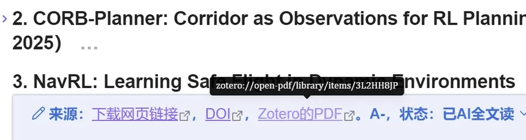

> **图 3 · zotero-obsidian-paper-import：** 【自动写入的论文链接；在 Obsidian 点击后**直接跳到 Zotero 中该论文 PDF 的对应位置**。】

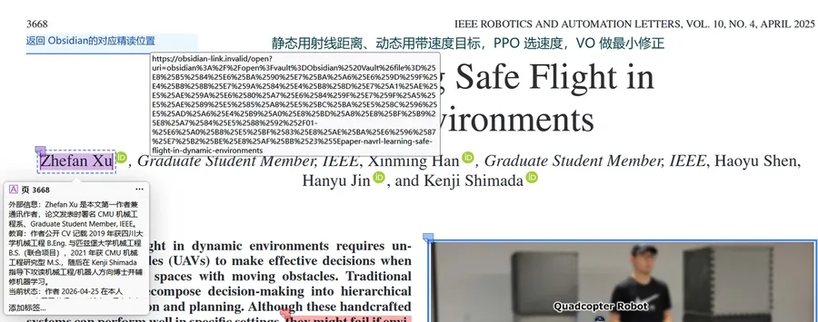

> **图 4 · zotero-obsidian-paper-import：** 【自动回填的跳转区；在 Zotero 点击后**返回 Obsidian 笔记的对应位置**。】

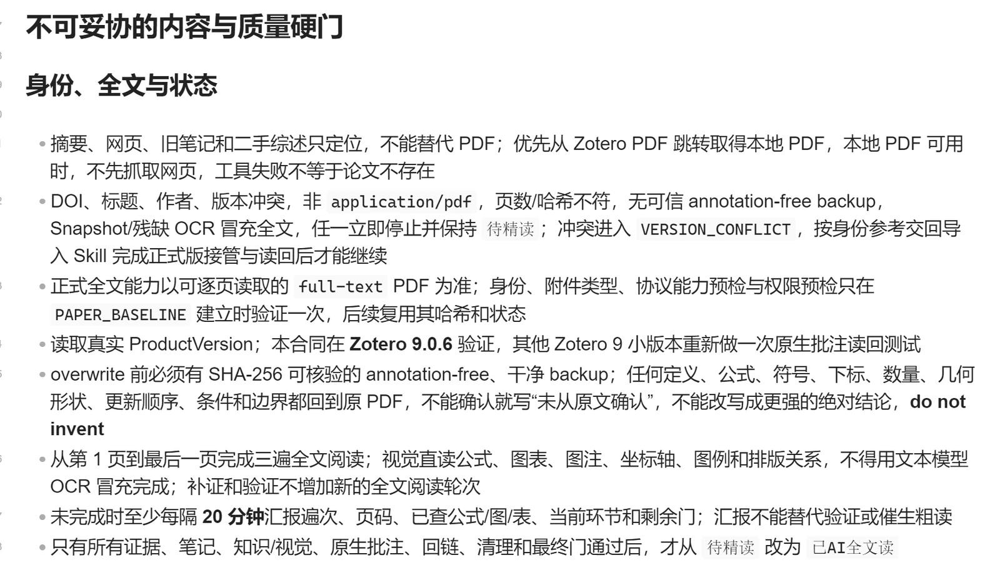

> **图 5 · read-paper-analysis-highlight：** 【导入前核对论文身份与 PDF，**以此保证论文导入来源正确**：版本对、文件全、页码图表对得上。】

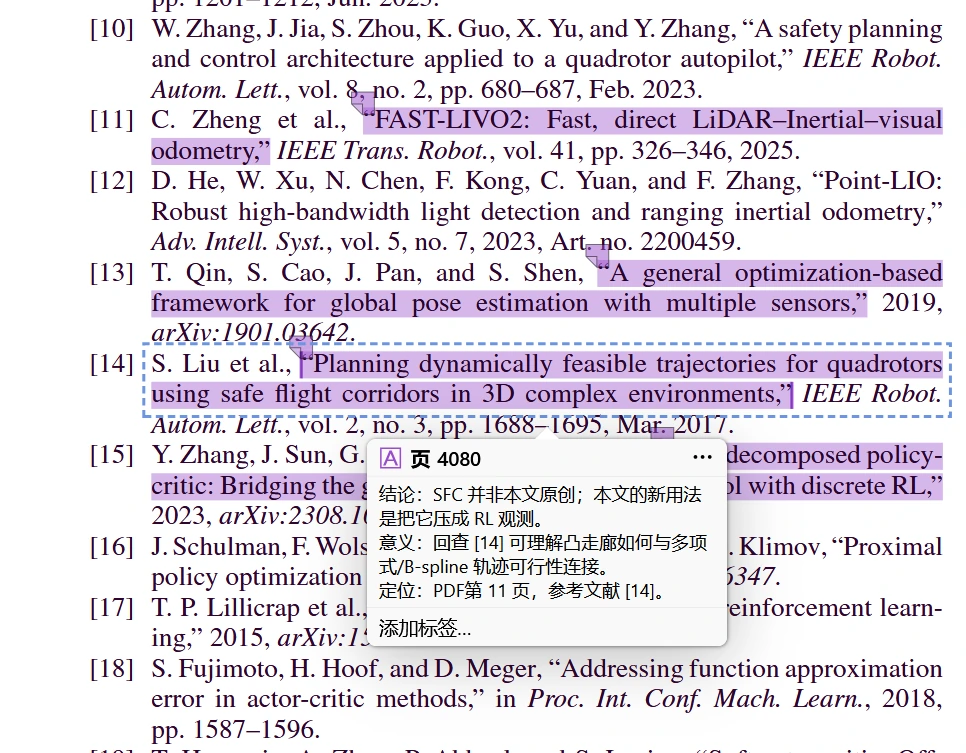

> **图 6 · read-paper-analysis-highlight：** 【**自动**对下载下来的论文 PDF 的关键引用单独标注，方便追溯奠基论文，看清「这条结论站在谁的工作上」。】

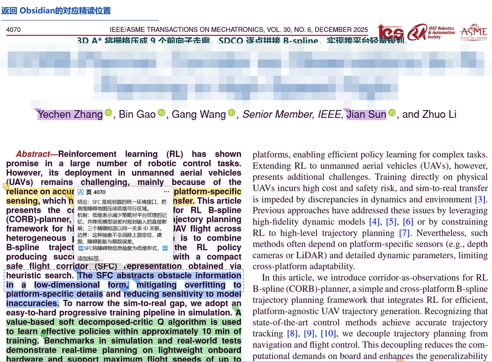

> **图 7 · read-paper-analysis-highlight：** 【标题顶部**自动**加一段通俗总览，由 PDF 直接总结得到，目的是**直观了解论文的方法实现**。图中仅对论文标题局部打码，作者与期刊信息保留。】

---

### 4.2 知识组织（obsidian-note-style）

读完之后，内容进入 Obsidian 知识网络。它**自动**留下这些「看得见的结构」：

1. **自动分层折叠**  
   【笔记按 **问题 → 方法 → 证据 → 细节** 分层；标题和结论露在外面，推导、长表格收进折叠块。多篇论文并列时，先扫同一骨架，再决定展开哪一篇。】

2. **自动颜色标注重点**  
   【用颜色区分**论文原述 / 研究者推断 / 待核验**，并在重点处加高亮，突出不同层面的技术路径，避免将推断误作原文结论。】

3. **自动加入双向链接**  
   【相关概念、同主题论文、前置知识之间**自动建 Wiki 双链**，点击即可跳转，把分散笔记归并成知识网。】

4. **自动补基础知识点并建跳转（递进阅读）**  
   【若文中出现 **HOCBF-QP** 这类高阶用法，而它由 **CBF（控制屏障函数）** 等基础内容演化而来，笔记里又**没有基础 CBF 描述**时，**自动新建基础知识点页并链回原论文段落**。读者可以从最简单的定义进入，再递进到论文中的具体用法，而不是空降缩写。】

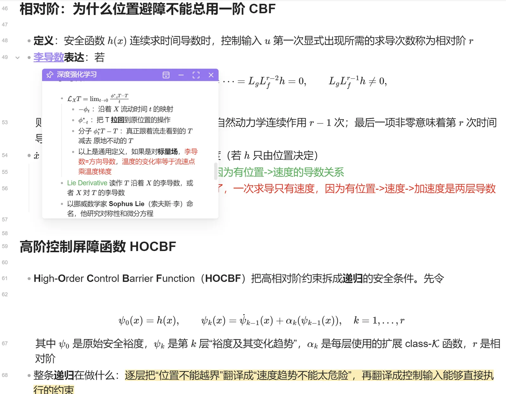

> **图 8 · obsidian-note-style：** 【**自动**按问题/方法/证据分层并生成折叠结构；正文可编辑，便于人工改写。】

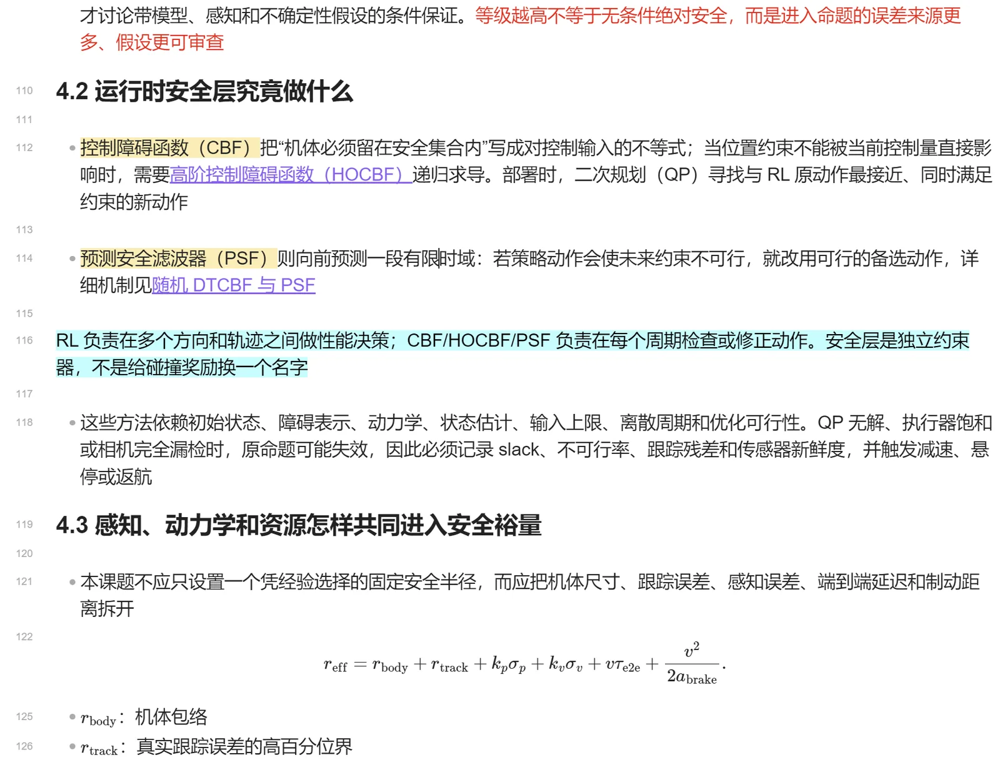

> **图 9 · obsidian-note-style：** 【**自动**用颜色标注区分不同重点内容，并**自动**加入跳转双向链接归并知识点；生成的高亮用于突出技术路径层次。】

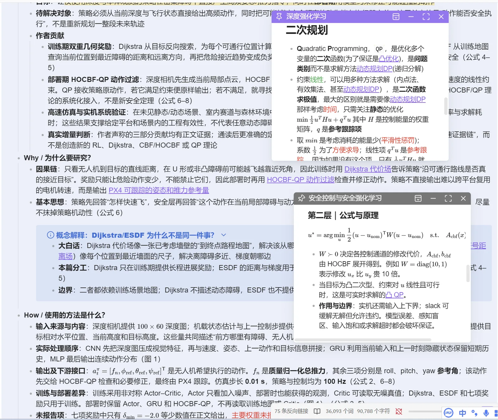

> **图 10 · obsidian-note-style：** 【**自动**建立概念之间的双向链接网络，从一篇论文走到相关方法与前置知识页。】

---

### 4.3 科研绘图（draw-style）

图不是装饰。draw-style 按**两层递进架构**出图：

**第一层 · 图形化直观理解**  
【用框图、流程、对比图把**对象是谁、数据从哪来、模块谁依赖谁**画出来。开题汇报、给非本方向的人讲，先看懂这一层。】

**第二层 · 公式化深入描述**  
【在需要精确核对时补上**公式、符号定义、坐标系、假设条件**，让读者能写进论文、能复现。】

**基础概念自动补全（和 4.2 联动）**  
【论文写到 **HOCBF-QP** 时，若笔记中没有 **CBF** 等基础描述，会**自动建立基础知识点并构建跳转链接**，使理解从最简单的定义递进到公式化深入描述。】

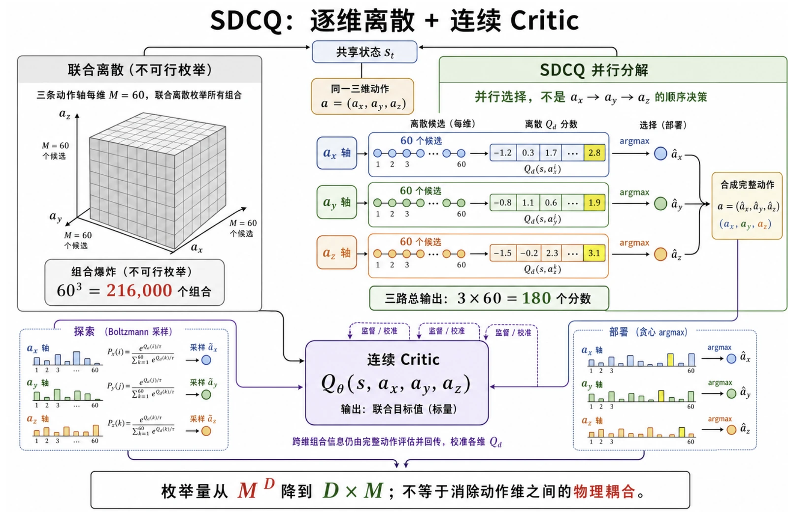

> **图 11 · draw-style（图形化直观理解层）：** 【方法/对比示意图；线型与颜色绑定固定语义，先让人看懂结构关系。】

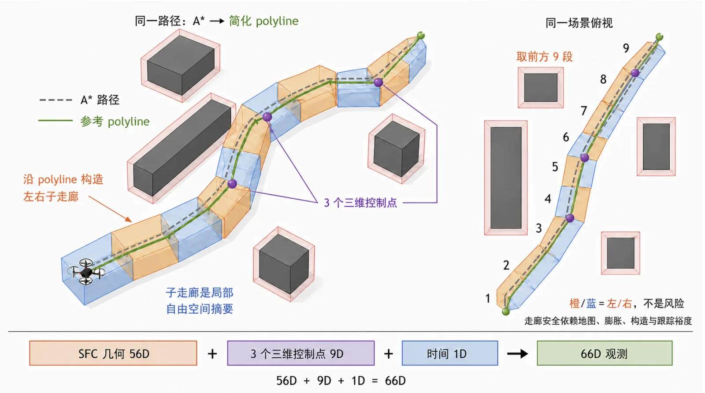

> **图 12 · draw-style：** 【换版式时**自动**保持同一套颜色/线型/图例，多图之间仍能对照。】

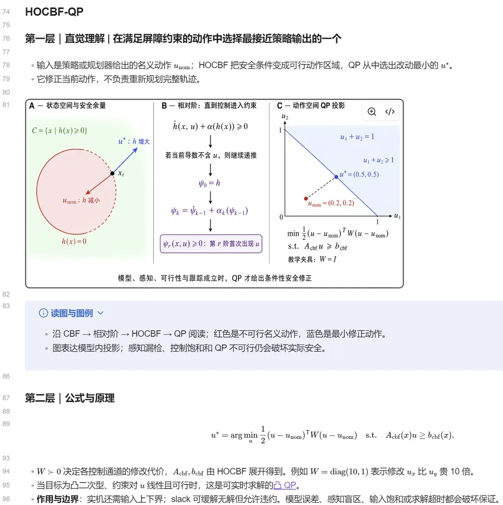

> **图 13 · draw-style：** 【**分两层（图形化直观理解 + 公式化深入描述）的两层递进架构。** 当论文出现 HOCBF-QP 这类由 CBF 演化来的知识点，而笔记中尚无基础 CBF 描述时，**自动**补建基础知识点并生成跳转链接，使阅读能从最简单的理解逐步递进到公式化深入描述。】

---

### 4.4 广域检索（searching-at-scale）

**目标：** 在**一次任务里快速搜到足够多的信息**。部分 AI 对话每轮只返回固定数量结果，来回追问也补不齐；本 Skill 的设计目的就是**省时间、一次铺开**。

**自动交付的东西**

1. **大规模候选列表**  
   【按查询矩阵在多个站点入口翻页、发现 Sitemap、抓取候选；一轮内观察到成百上千条 URL，而不是十几条精选。】

2. **发现—筛选轨迹**  
   【哪些 URL 进来、哪些被去掉、规则是什么，过程可回放复盘。】

3. **耗时与吞吐数字**  
   【例如单位时间 URL 观察数、有效结构化记录数，用来判断「够不够快、卡在哪」。】

4. **覆盖与缺口说明**  
   【停止条件、未闭合来源、下一轮该补什么；避免误以为「已经搜全」。】

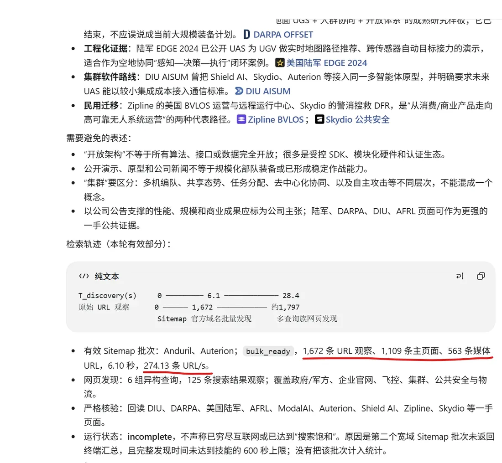

> **图 14 · searching-at-scale：** 【**自动**记录的一次调研「发现—筛选」轨迹，用来说明**一次性大规模搜集**如何在较短时间内铺开信息面。调研主题关键字已遮盖；结构、来源链、耗时保留。】

---

### 4.5 故障复用（collect-bug-update-accelerate）

1. **自动记事件**  
   【报错现象、发生阶段、运行环境写入事件库，聊天刷过去也不会丢。】

2. **自动归问题族**  
   【同一失败机制归到一处，避免十几条事件各存一份近似解法。】

3. **自动复用已验证路线**  
   【命中已验证方案时按步骤执行并**做效果核对**；失败则把该方案标退，不硬套。】

4. **自动留下可检索台账**  
   【下次从「症状」直接跳到「怎么修、怎么验证」。】

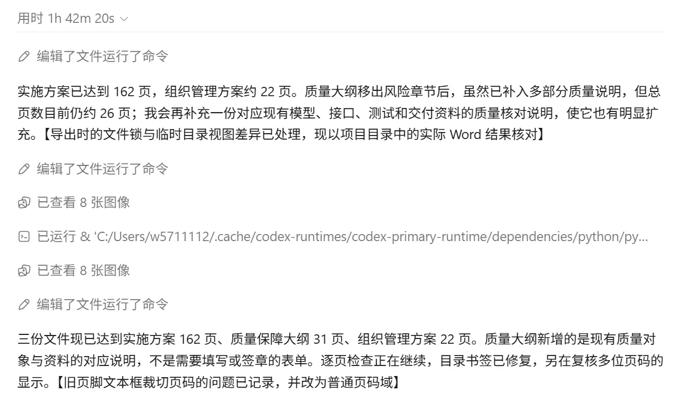

> **图 15 · collect-bug-update-accelerate：** 【运行中**自动**留下问题记录与修复线索，形成可复用台账。】

---

### 4.6 学术 PPT（姊妹仓）

**academic-native-ppt-design-HNU-style** 在生成 `.pptx` 时**自动**套用湖大母版、字阶档位、印章禁飞区，并用 `audit_hnu_deck.py` 检查字号与出框。

| 封面感 | 中间页 | 收束感 |
| --- | --- | --- |
|  | 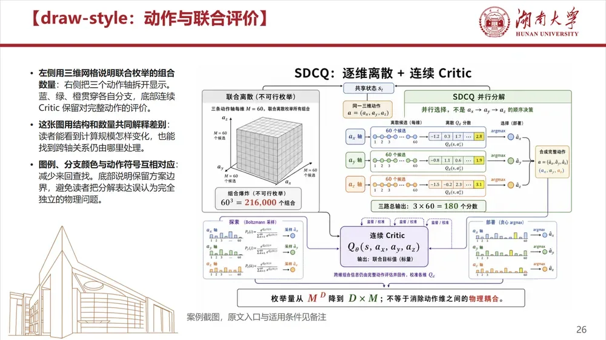 |  |

> **图 16 · academic-native-ppt-design-HNU-style 预览。** 【自动排版结果示意；完整 10 张见 [姊妹仓](https://github.com/w5711112/academic-native-ppt-design-HNU-style)。】

---

## 5. 为什么做成 Skill / Plugin

问答给一段文字就结束了。科研还要**留下 PDF、Zotero 条目、高亮、笔记和可点链接**。Skill 把「做什么、输入输出、何时停」写死，Agent 照着跑；Plugin 把常一起用的脚本和配置打包，避免每次从提示词拼装。

---

## 6. 几条有代表性的规则

### renhua

- **破折号（——）和分号基本不用**，该断句就改句号。  
- **长句短句错开**，避免连续等长句子。  
- **只改说法，不改事实**：数字、术语、引语、「可能 / 显著」等限定强度不变。  
- **去掉空话**，有依据的「应 / 须 / 严禁」保留力度。

### read-paper / zotero-import

- **正式期刊/会议版本优先**，不把 arXiv 预印本当最终版。  
- **PDF 打开核对**页码、图表、公式后再入库。  
- 结论**锚定原文位置**，关键引用单独标注。

### searching-at-scale / Edge 桥

- 扩展权限限**检索相关站点**；不用 CDP / 键鼠注入。  
- **专用 profile 与独立管道**，与日常 Edge 分开。  
- **`edge_bridge_ctl.py`** 负责装 Native Host、起 Edge、探管道；各宿主同一命令。

### draw-style

- 先定图在证明**比较 / 层次 / 流程 / 分布**中的哪一种，再落到直观层或公式层。  
- 同一语义**固定**颜色、线型、图例。  
- 高阶概念缺基础页时**自动补链**，不让读者空降缩写。

### HNU PPT（姊妹仓）

- 先选版式再填内容；正文 **16–18 pt**，高密 **13–14.5 pt**，行距约 **18–20 pt**。  
- **印章区自动留空**。  
- **`audit_hnu_deck.py` 自动**查字号下限、出框、误粘贴 Markdown。

---

## 7. 仓库结构

```text
Unified-Scholarflow-Skills/
├─ plugins/
│  ├─ skill-governance-plugin/
│  │  └─ skills/
│  │     ├─ collect-bug-update-accelerate/   # 故障事件、问题族、已验证方案复用
│  │     ├─ github-upload/                   # 去隐私公开包、README、发布确认
│  │     ├─ migration-skill/                 # 跨宿主迁移与能力差异核对
│  │     ├─ skill-ecosystem-governor/        # 注册表、依赖、版本与同步
│  │     └─ workspace-hygiene/               # 工作区体积、旧版本、可恢复清理
│  └─ drone-literature-scout-plugin/
│     ├─ integrations/zotero-local-bridge/   # Zotero 本地桥接扩展
│     └─ skills/
│        ├─ draw-style/                      # 两层递进图：直观 + 公式
│        ├─ drone-literature-scout/          # 发现、核验、质量分层
│        ├─ obsidian-note-style/             # 分层笔记、配色、双链、基础补全
│        ├─ read-paper-analysis-highlight/   # 视觉+文本精读、PDF 标注、结构汇总
│        ├─ searching-at-scale/              # 一次性大规模检索与轨迹统计
│        │  ├─ edge-extension/
│        │  ├─ native-host/
│        │  └─ scripts/edge_bridge_ctl.py
│        └─ zotero-obsidian-paper-import/    # 正式版本、Zotero 写入、Obsidian 回链
├─ skills/
│  ├─ renhua/
│  └─ skill-contract-lock/
├─ docs/images/
├─ README.md
├─ LICENSE
├─ SECURITY.md
└─ THIRD_PARTY_NOTICES.md
```

---

## 8. 各 Skill 做什么（详细）

### 8.1 searching-at-scale · 一次搜够

| 维度 | 说明 |
| --- | --- |
| **最显眼的用处** | **一轮任务搜到足够多候选**，用来代替「对话里每轮固定几条、反复补搜」 |
| **对什么操作** | 公开网页检索入口、Sitemap、可配置站点列表 |
| **用什么手段** | 查询矩阵 + 多入口翻页 + 去重；Edge 扩展做登录态下的页面投影 |
| **软件里留下什么** | 候选清单（URL + 字段）、发现/淘汰轨迹、耗时吞吐表、覆盖缺口 |
| **为什么要它** | **省时间**：信息面在一次运行里铺开，后续筛选有足够素材 |
| **不做什么** | 不判断论文是否值得精读（交给 drone-literature-scout） |

### 8.2 drone-literature-scout · 只让值得读的进证据链

| 维度 | 说明 |
| --- | --- |
| **最显眼的用处** | 把「一堆链接」收成**可信文献集合**，并写清为何纳入/排除 |
| **对什么操作** | searching 交来的候选、已知论文库 |
| **用什么手段** | 正式来源与发表渠道核验、身份核对、质量分层打分 |
| **软件里留下什么** | 去重后的文献列表、来源与全文状态、纳入排除理由、主题结构 |
| **为什么要它** | 避免把搜索摘要、转载页、掠夺性来源当正式结论依据 |
| **示例** | 无人机主题完整走一遍筛选（可替换为其他领域关键词） |

### 8.3 zotero-obsidian-paper-import · 正确版本自动入库并双链

| 维度 | 说明 |
| --- | --- |
| **最显眼的用处** | Zotero 里出现**正确的那一篇 + 真的 PDF**，Obsidian 里出现**可点入口** |
| **对什么操作** | DOI/正式出版页、合法 PDF、Zotero 库、Obsidian 论文索引 |
| **用什么手段** | 正式版本优先策略；父条目 + 存储附件写入；写后读回对账；重复合并 |
| **软件里留下什么** | Zotero 条目与附件；Obsidian 链接；跳转两侧可用 |
| **为什么要它** | 错版本会毁掉后续全部精读；外链 PDF 也撑不起离线批注 |
| **跳转** | 笔记链接 → Zotero PDF 位置；Zotero 跳转区 → Obsidian 段落 |

### 8.4 read-paper-analysis-highlight · 精读、标注、汇总

| 维度 | 说明 |
| --- | --- |
| **最显眼的用处** | 打开 PDF 能看见**彩色高亮 + 理解批注**；打开 Obsidian 能看见**结构化总结** |
| **对什么操作** | 已入库的正式 PDF（含图、表、公式） |
| **用什么手段** | AI **文本 + 视觉**精细读取；语义选区；批注框写反馈 |
| **PDF 里留下什么** | 分色高亮、标注框、对方法/假设/实验的**理解反馈**（不是译文） |
| **Obsidian 里留下什么** | 问题/解法、作者出处、公式原理、实验过程、代码视频补充材料；可折叠速览 |
| **为什么要它** | 让「读过的」变成「查得到、跳得回、说得清」的资产 |
| **追溯** | 结论锚原文位置；关键引用单独标出，方便追奠基论文 |

### 8.5 obsidian-note-style · 知识网络与递进阅读

| 维度 | 说明 |
| --- | --- |
| **最显眼的用处** | 多篇论文仍是**统一分层、可折叠、点得通**的知识库 |
| **对什么操作** | 已核验的精读草稿、现有 Vault 结构 |
| **用什么手段** | 规范化标题层级、Callout、配色语义、Wiki 双链、媒体整理 |
| **软件里留下什么** | 分层笔记、颜色区分原述/推断/待核验、概念双链网 |
| **为什么要它** | 没有结构的笔记，数周后也难以检索回读 |
| **递进能力** | 高阶概念（如 HOCBF-QP）缺基础（如 CBF）时**自动建基础页并互链** |

### 8.6 draw-style · 两层递进的图

| 维度 | 说明 |
| --- | --- |
| **最显眼的用处** | 图**先看懂，再经得起公式核对** |
| **第一层** | 图形化直观理解：框图/流程/对比，讲清对象与数据流 |
| **第二层** | 公式化深入描述：符号、假设、约束 |
| **对什么操作** | 方法关系、知识依赖、实验数据 |
| **用什么手段** | 图型路由 + 语义编码（色/线/例）+ 成图检查 |
| **软件里留下什么** | 可嵌入 PPT/论文/笔记的图，语义编码在多图间一致 |
| **为什么要它** | 避免「好看但说不清证明什么」的装饰图 |

### 8.7 治理类

**collect-bug-update-accelerate**  
【故障发生时自动记事件、归问题族；命中已验证方案则按步骤修并核对效果，留下「症状 → 修法 → 验证」台账。】

**github-upload**  
【自动打去隐私公开包：去密钥与本机路径，补 README/依赖说明，本地审计后再确认是否推送远程。】

**migration-skill**  
【把整包 Skill 迁到另一 Agent/宿主时，自动列出工具与路径差异，并做能力核对清单。】

**skill-ecosystem-governor**  
【自动维护注册表与依赖图，驱动完整指南/总览同步和 audit，避免各处哈希漂移。】

**workspace-hygiene**  
【先预演出体积与可删项，再可恢复清理旧版本与缓存，不直接永久删。】

### 8.8 独立

**renhua**  
【对中文正文做规则化改写：句子变顺，人名数字术语「可能/显著」等强度不变。】

**skill-contract-lock**  
【多 Skill 协作时锁住原始要求与证据哈希，防止用摘要或计划替代权威规则。】

---

## 9. 多宿主与 Edge 联动

**Codex、Claude Code、Kimi Code、MiMo Desktop** 均可加载同一套 `SKILL.md` + `scripts/`。

**MiMo Desktop 与 Edge 已实测打通：**

```powershell
python scripts\edge_bridge_ctl.py status
python scripts\edge_bridge_ctl.py install
$profile = Join-Path $env:TEMP 'mimo-scholarflow\edge-profile'
New-Item -ItemType Directory -Force -Path $profile | Out-Null
python scripts\edge_bridge_ctl.py launch --profile $profile --replace
python scripts\edge_bridge_ctl.py probe --profile $profile --timeout-ms 15000
```

`probe` 为 **`ok: true`** 时：**Agent → Edge 扩展 → Native Host → 命名管道** 全链路可用。

| 宿主 | 加载 | Edge |
| --- | --- | --- |
| Codex | Plugin / 技能目录 | 同一 `edge_bridge_ctl.py` |
| Claude Code | `.agents/skills` 等 | 同一命令 |
| Kimi Code | 技能目录 | 同一命令 |
| MiMo Desktop | 对话指定路径或技能目录 | 同一命令（**已验证**） |

---

## 10. 使用前提与安装

**前提：** Agent 宿主；Edge/Chromium + 扩展 + `edge_bridge_ctl.py install`；Zotero Connector（可选 `zotero-local-bridge`）；Obsidian Vault。  
**依赖：** Python 3、Node.js、PyMuPDF、pypdf、PyYAML 等（见各目录 `REQUIREMENTS.md`）。

**最小闭环：** Obsidian 列出论文 → **一轮大规模搜候选** → **自动钉正式版入库** → PDF 上**自动高亮批注** → Obsidian **自动汇总并补基础概念** → 双向互跳。

```powershell
git clone https://github.com/w5711112/Unified-Scholarflow-Skills.git
```

独立 Skill 整目录拷入 `~/.agents/skills/<name>/`；Plugin 保留整个 `plugins/<name>/`。首次运行前改路径、主题、来源范围与软件设置。

---

## 11. 仓库内容与隐私

含规则、脚本、占位符配置与脱敏示意图。调研关键字已遮盖，论文标题局部打码。自动下载仅针对出版社、会议、机构仓储或作者明确提供的合法入口。见 [SECURITY.md](SECURITY.md)。

## Related

[academic-native-ppt-design-HNU-style](https://github.com/w5711112/academic-native-ppt-design-HNU-style)

## 许可

[LICENSE](LICENSE) · [THIRD_PARTY_NOTICES.md](THIRD_PARTY_NOTICES.md)

---

## English summary

**Unified-Scholarflow-Skills v1.1** makes research handoffs inspectable: **bulk search** in one run, **official-version import** into Zotero with real PDF attachments, **vision+text close reading** that leaves colored highlights and understanding notes (not translations) in the PDF, **structured Obsidian summaries** (problem, method, authors, formulas, experiments, code/video), **auto prerequisite pages** (e.g. CBF under HOCBF-QP) with links, and **two-tier figures** (intuitive then formula-level).

Jump path: Obsidian paper link → Zotero PDF location; Zotero jump area → Obsidian note location.

Hosts: Codex, Claude Code, Kimi Code, MiMo Desktop. Edge bridge verified via `edge_bridge_ctl.py`.
