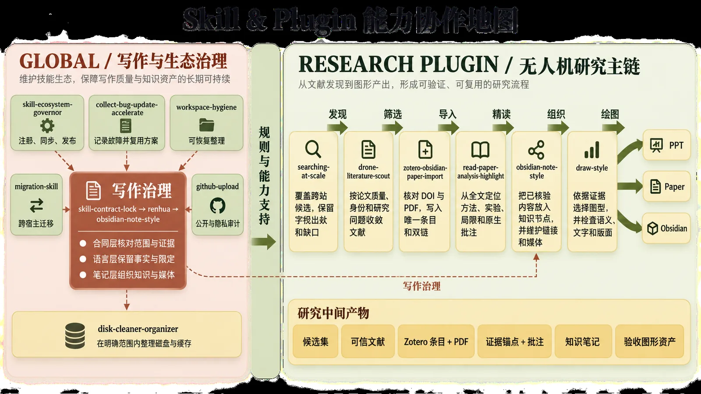
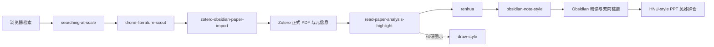

# Unified-Scholarflow-Skills

> 多 Agent 通用的科研检索、文献管理、精读笔记、科研绘图与 Skill 治理工作流。  
> Agent-agnostic research skills for literature discovery, reading notes, scientific figures, and skill governance.

**版本 v1.1** · 主仓库 · 姊妹仓库：[academic-native-ppt-design-HNU-style](https://github.com/w5711112/academic-native-ppt-design-HNU-style)

---

## 这套东西解决什么问题

科研时间很多耗在交接处：论文找到了附件没归档，笔记写完了图表依据丢了，组会前再重新压文字、调版式。本仓库把反复出现的操作写成可执行规则，让 Agent 串起检索、核验、导入、精读、组织、绘图和治理，而不是每次从空白提示词开始。

它不是下载后免配置的成品。使用者需要按自己的方向补检索主题、来源范围、路径和写作偏好。仓库提供完整架构与已验证实现；领域判断仍由人完成。

本次公开版不包含数学建模相关 Skill。标 ★ 的是人工调优较多的部分；未标星项目仍属于完整体系。

**可以改。** 下列配置大量体现维护者的个人习惯（笔记层级、检索站点、评分门槛、写作语气）。克隆后完全可以改成自己的笔记与检索习惯；不改也能跑通主流程，只是示例领域味道更重。

## 效果一览

### 体系协作地图



左侧是写作与生态治理，右侧是文献发现到图形产出的研究主链。箭头表示成果交接，不表示每一步都已全自动。

### 论文精读与 Zotero–Obsidian 双向联动


论文正式 PDF、元信息、原生高亮与结构化精读笔记在同一条证据链上。重点不是逐句翻译，而是把问题、方法、技术路线、证据和局限放到能复用的位置。


最后一张对论文标题与作者做了马赛克，避免版权与可识别信息外泄；绿色批注与页面结构仍可辨认。

### 知识组织（obsidian-note-style）


笔记可折叠、可编辑，多论文并列时先看统一层级，关键方法再单独展开。

### 科研绘图（draw-style）


依据证据选图型，再约束布局、配色、字体与文字密度，并做成图检查。

### 广域检索（searching-at-scale）


图中调研主题关键字已遮盖。结构、来源链与耗时统计保留，用来说明“发现—筛选”轨迹怎么记。

### 故障复用（collect-bug-update-accelerate）


真实故障进事件与问题族，验证过的路线可复用，避免原样重复失败。

### 学术 PPT 预览（HNU-style）

| 封面感 | 中间页 | 收束感 |
| --- | --- | --- |
|  |  |  |

完整 10 张效果图、规则与脚本见姊妹仓库 **[academic-native-ppt-design-HNU-style](https://github.com/w5711112/academic-native-ppt-design-HNU-style)**。旧的通用 `academic-native-ppt-design` 与 `codex-ppt` 已从本仓库撤下，演示能力以 HNU-style 为准。

## 为什么做成 Skill / Plugin

一次问答往往以文字结束。科研任务还要读文件、调工具、保存结果，并证明结果可用。把“做什么、输入什么、交付什么、哪里停”写成 Skill，Agent 才能多步推进且可核对。

Plugin 把一组能协同的 Skill、脚本、配置和集成装在一起。可以只装单个 Skill，也可以保留整个插件目录，让检索、导入、精读和治理按既定关系配合。

## 实现里几条有代表性的规则

只列容易理解的几条，完整条文在各 `SKILL.md` 与 `references/`。

1. **事实与表达分离（renhua）**  
   改写只动表达。人物、数字、术语、引语、限定词和论断强度逐项保留；对应不了规则的改动要撤销。

2. **正式来源优先（drone-literature-scout / zotero-obsidian-paper-import）**  
   搜索摘要不当论文事实。先核 DOI 与正式版本，再取允许下载的 PDF；身份不清就不写父条目。

3. **全文证据锚点（read-paper-analysis-highlight）**  
   方法、实验、局限都要能指回正文位置。视觉模型直接读渲染图像，不把 OCR 降级当成等价证据。

4. **隔离脱敏发布（github-upload）**  
   源包只读，公开副本单独生成；去密钥、邮箱、本机绝对路径，研究关键词只按明确清单泛化。远程写入前必须再确认。

5. **Edge 桥接最小权限（searching-at-scale）**  
   Manifest V3 + Native Messaging Host + 命名管道。不启用 CDP/WebDriver/键鼠注入；专用 profile 与日常 Edge 分管道共存。

6. **要求—证据锁（skill-contract-lock）**  
   多 Skill 协作时锁住原始要求与证据边界，防止摘要或计划替代权威规则。

## 仓库结构

```text
Unified-Scholarflow-Skills/
├─ plugins/
│  ├─ skill-governance-plugin/
│  │  └─ skills/
│  │     ├─ collect-bug-update-accelerate/
│  │     ├─ github-upload/
│  │     ├─ migration-skill/
│  │     ├─ skill-ecosystem-governor/
│  │     └─ workspace-hygiene/
│  └─ drone-literature-scout-plugin/
│     └─ skills/
│        ├─ draw-style/
│        ├─ drone-literature-scout/
│        ├─ obsidian-note-style/
│        ├─ read-paper-analysis-highlight/
│        ├─ searching-at-scale/
│        └─ zotero-obsidian-paper-import/
├─ skills/
│  ├─ renhua/
│  └─ skill-contract-lock/
├─ docs/
│  ├─ images/                 # 本页效果图（已脱敏、已压缩）
│  └─ examples-archive/       # 旧图归档，不在本页展示
├─ README.md
├─ LICENSE
├─ SECURITY.md
└─ THIRD_PARTY_NOTICES.md
```

学术 PPT 请安装姊妹仓库的 `academic-native-ppt-design-HNU-style`，不要从本仓库找旧 PPT Skill。

## 每个 Skill 做什么

### drone-literature-scout-plugin：科研阅读工作流

| Skill | 作用 |
| --- | --- |
| ★ searching-at-scale | 多入口较大规模检索，收集候选并保留来源证据与停止说明；公开版需自填关键词与站点范围。 |
| ★ drone-literature-scout | 在无人机等主题示例上做高质量文献发现与核验，优先正式来源与高可信发表渠道。 |
| ★ zotero-obsidian-paper-import | 核验 DOI 与正式版本，写入 Zotero 父条目与附件，回填 Obsidian 可跳转链接。 |
| ★ read-paper-analysis-highlight | 逐页读正文、公式和图，提炼问题/方法/证据/局限，生成可编辑高亮与精读笔记。 |
| ★ obsidian-note-style | 组织为层级清楚、可折叠、可编辑的 Obsidian 笔记并维护知识链接。 |
| ★ draw-style | 为方法图、知识点图和数据图选型并检查版面与语义。 |

### skill-governance-plugin：治理与发布

| Skill | 作用 |
| --- | --- |
| ★ collect-bug-update-accelerate | 记录真实技术故障，复用已验证解决路线。 |
| github-upload | 生成去隐私公开副本，补 README 与依赖说明，审计后再进入发布确认。 |
| migration-skill | 在 Codex、Claude Code、Kimi Code 等环境之间迁移 Skill 并核对能力差异。 |
| skill-ecosystem-governor | 维护注册表、依赖、聚合指南与版本一致性。 |
| workspace-hygiene | 预演并可恢复地整理工作区体积与旧版本。 |

### 独立 Skills

| Skill | 作用 |
| --- | --- |
| ★ renhua | 简体中文人性化改写，去掉 AI 腔与失衡姿态，保留术语、证据与正式程度。 |
| skill-contract-lock | 多 Skill 协作时锁定原始要求与证据边界。 |

## 核心工作流



## 多宿主：Codex / Claude Code / Kimi / MiMo Desktop

Skill 以标准 `SKILL.md` + `references/` + `scripts/` 交付，不绑定单一聊天产品。

| 宿主 | 加载方式 | Edge 联动 |
| --- | --- | --- |
| Codex | Plugin 或技能搜索路径 | 同一 `edge_bridge_ctl.py` |
| Claude Code | `.agents/skills` 或项目技能目录 | 同一命令 |
| Kimi Code | 技能目录 | 同一命令 |
| **MiMo Desktop** | 对话内指定路径或技能目录 | **同一命令，已实测可起 Edge 并收到投影** |

### MiMo 与 Edge 真实联动（已验证）

不要只写“理论兼容”。在 `searching-at-scale` 目录执行：

```powershell
python scripts\edge_bridge_ctl.py status
python scripts\edge_bridge_ctl.py install
$profile = Join-Path $env:TEMP 'mimo-scholarflow\edge-profile'
New-Item -ItemType Directory -Force -Path $profile | Out-Null
python scripts\edge_bridge_ctl.py launch --profile $profile --replace
python scripts\edge_bridge_ctl.py probe --profile $profile --timeout-ms 15000
```

`probe` 返回 `ok: true` 即表示：当前 Agent（含 MiMo）→ Edge 扩展 → Native Host → 命名管道全链路已通。细节见 `plugins/drone-literature-scout-plugin/skills/searching-at-scale/references/mimo-edge-integration.md`。

## 使用前提

完整联动通常需要：

1. **Agent 宿主**（Codex / Claude Code / Kimi / MiMo Desktop 等）：加载本仓库 Skill 或 Plugin，执行脚本。  
2. **浏览器（Edge/Chromium）**：安装 `searching-at-scale/edge-extension/`，并用 `edge_bridge_ctl.py install` 注册 Native Host。关键词与站点范围必须换成自己的配置。  
3. **Zotero**：Connector + 允许本机通信；需要原生批注回链时安装 `integrations/zotero-local-bridge/`。  
4. **Obsidian**：自己的 Vault 与论文索引；允许 `obsidian://`，条目保留稳定标题或 block ID。

常用依赖：Python 3、Node.js，以及 PyMuPDF、pypdf、PyYAML 等。以各目录 `REQUIREMENTS.md` / `package.json` 为准。

最小闭环：Obsidian 列出论文或主题 → Agent 经 Edge 核验正式来源 → 合法 PDF 写入 Zotero → 精读与原生高亮 → 写回 Obsidian → 两侧互跳。

## 安装

```powershell
git clone https://github.com/w5711112/Unified-Scholarflow-Skills.git
```

- 独立 Skill：复制完整目录到技能搜索路径，例如 `~/.agents/skills/<skill-name>/`，不要只拷 `SKILL.md`。  
- Plugin：保留整个 `plugins/<plugin-name>/`，再按宿主的插件方式加载。  
- 首次运行前改示例配置：路径、研究主题、来源范围、时间预算、Zotero/Obsidian、浏览器扩展位置。  
- 治理插件的注册表与锁依赖本机路径，公开包不携带维护者运行态锁，请在自己环境生成。

## 公开版边界

- 示例中的无人机方向只用于说明工作流；其他领域请替换主题词、来源范围、术语表和质量标准。  
- 不附带账号、密码、API key、真实本机绝对路径、私有 Vault、Zotero 数据库或未授权论文 PDF。  
- 自动下载只针对出版社、会议、机构仓储或作者明确提供的合法全文入口。  
- “哪些来源可信”依赖领域配置，通用默认值不能替代你的判断。  
- 效果图已做隐私处理：调研关键字遮盖、论文标题马赛克；禁传的方向/大组类截图未进入仓库。

## Related

- 学术 PPT（湖南大学风格，完整 10 图与规则）：[academic-native-ppt-design-HNU-style](https://github.com/w5711112/academic-native-ppt-design-HNU-style)

## 许可

代码与仓库自有文本按 [LICENSE](LICENSE) 使用。浏览器、Zotero、Obsidian 等第三方组件受各自许可约束，见 [THIRD_PARTY_NOTICES.md](THIRD_PARTY_NOTICES.md)。安全问题见 [SECURITY.md](SECURITY.md)。

---

## English summary

**Unified-Scholarflow-Skills v1.1** is an agent-agnostic research workflow: large-scale web discovery, literature vetting, Zotero–Obsidian import, full-text reading with native highlights, note organization, scientific figures, Chinese prose cleanup (`renhua`), and skill governance.

It is **not** zero-config. Bring your own topics, source allowlists, paths, and writing style. The defaults encode one researcher’s habits and are meant to be edited.

Hosts: Codex, Claude Code, Kimi Code, and **MiMo Desktop** all load the same `SKILL.md` packages. Edge integration is real, not documentation-only: `scripts/edge_bridge_ctl.py` installs the native messaging host, launches Edge with the bundled extension, and probes the broker pipe.

Academic slides live in the sibling repo [academic-native-ppt-design-HNU-style](https://github.com/w5711112/academic-native-ppt-design-HNU-style). Modeling skills are intentionally unpublished.
