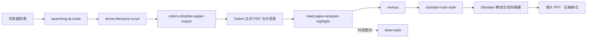

# Unified-Scholarflow-Skills

多 Agent 通用的科研检索、文献管理、精读笔记、科研绘图与 Skill 治理工作流。

Agent-agnostic research skills for literature discovery, reading notes, scientific figures, and skill governance.

**版本 v1.1** · 姊妹仓库：[academic-native-ppt-design-HNU-style](https://github.com/w5711112/academic-native-ppt-design-HNU-style)（湖大风格学术 PPT）

---

## 解决什么问题

科研时间大量耗在环节交接上。论文搜到了，还要核对版本、下载 PDF、补齐元数据。读完了，笔记散落在浏览器、文件夹和几个软件里。组会前又要把文字压短、图表换掉、版式重排。

本仓库把这些反复出现的操作写成可执行规则，让 Agent 按固定步骤推进检索、核验、导入、精读、组织、绘图和治理。每一步都有明确的输入、输出和核对条件。

使用前请按自己的方向补检索主题、来源范围、路径和写作偏好。默认配置带有维护者的个人习惯，克隆后可以改；不改也能跑通主流程，示例里的领域词会更重一些。

标 ★ 的项目人工调优较多。

---

## 整套体系

下图是全局地图。左边是写作与生态治理，右边是从文献发现到图形产出的研究主链。


*图 1 · 全体系协作地图，也展示了 draw-style 的成图风格。治理侧维护规则、发布和故障复用。研究侧处理论文来源、可靠性、内容提取和复用。*

---

## 核心工作流



先确认是哪一篇、版本可不可信，再读全文取证据，然后理顺表达，最后放进可检索的知识网络。

---

## 论文精读与 Zotero–Obsidian 双向联动

这是整条链里最常用的一段。论文正式 PDF、元信息、Zotero 原生高亮和 Obsidian 结构化笔记放在同一条证据链上。从笔记能跳回 PDF 对应位置，从 Zotero 也能回到笔记。


*图 2 · `read-paper-analysis-highlight` 与 `zotero-obsidian-paper-import` 的联动效果。左侧是论文与批注，右侧是笔记层级与跳转。输出侧重问题、方法、技术路线、证据和局限的可复用记录。*

同一链路的两个跳转细节：


*图 3 · `zotero-obsidian-paper-import`：在 Obsidian 点链接，回到 Zotero 阅读位置。*


*图 4 · `zotero-obsidian-paper-import`：在 Zotero 侧回到对应笔记段落。*

### 精读抓什么

`read-paper-analysis-highlight` 逐页阅读正文、公式和图，写清作者解决的问题和证据范围。结论标注原文位置，方便复查和顺参考文献往前追。


*图 5 · `read-paper-analysis-highlight`：导入前核对论文身份与 PDF。*


*图 6 · `read-paper-analysis-highlight`：关键引用单独标注。*


*图 7 · `read-paper-analysis-highlight`：标题附近自动加一段通俗总览。图中对论文标题局部打码，作者与期刊信息保留。*

---

## 知识组织：obsidian-note-style

读完之后，内容放进能检索、能展开的笔记结构。`obsidian-note-style` 负责层级、折叠、高亮配色和双向链接，让多篇论文并列时层次清楚。


*图 8 · `obsidian-note-style`：笔记按问题、方法、证据分层，可折叠，正文可编辑。*


*图 9 · `obsidian-note-style`：颜色区分论文原述、自己的推断和待核验内容。*


*图 10 · `obsidian-note-style`：概念之间用双向链接连接，从一篇论文走到相关方法与前置知识。*

---

## 科研绘图：draw-style

`draw-style` 先确定这张图要表达什么关系，再选图型、定颜色语义和字号，最后检查文字裁切和图例与数据是否一致。


*图 11 · `draw-style`：方法或对比类示意图，线型与颜色承担固定含义。*


*图 12 · `draw-style`：换版式时语义编码保持不变。*


*图 13 · `draw-style`：把学习顺序画成层次。*

---

## 广域检索：searching-at-scale

需要跨站点尽量搜全时，用 `searching-at-scale`。它记录发现与筛选轨迹、耗时和来源证据。


*图 14 · `searching-at-scale`：一次调研的发现与筛选过程。调研主题关键字已遮盖，结构、来源链和耗时统计保留。*

文献是否值得进入研究证据链，由 `drone-literature-scout` 按正式来源和发表渠道质量筛选。示例主题使用无人机方向说明流程。

---

## 故障复用：collect-bug-update-accelerate

真实技术故障记成事件并归入问题族。已经验证过的处理路线可以复用。


*图 15 · `collect-bug-update-accelerate`：失败时留下可复用的问题记录。*

---

## 学术 PPT

演示文稿使用湖南大学风格的原生可编辑系统，见姊妹仓库。本页只放三张预览。

| 封面感 | 中间页 | 收束感 |
| --- | --- | --- |
|  |  |  |

*图 16 · `academic-native-ppt-design-HNU-style` 预览。完整 10 张大图、规则与脚本见 [academic-native-ppt-design-HNU-style](https://github.com/w5711112/academic-native-ppt-design-HNU-style)。*

---

## 为什么做成 Skill / Plugin

一次问答通常以一段文字结束。科研任务还要读文件、调浏览器和 Zotero、写笔记，并留下可检查的结果。把这些步骤写成 Skill，Agent 可以按固定输入输出推进，在需要判断的地方停下来，同类任务直接复用同一套步骤。

Plugin 把常一起使用的 Skill、脚本和配置装成一个包。可以只装单个 Skill，也可以保留整个插件目录，让检索、导入、精读按固定关系配合。

---

## 几条有代表性的规则

完整条文在各 `SKILL.md` 与 `references/`。下面挑几条好理解的。

### renhua：中文怎样写清楚

- 破折号（——）和分号基本不用。能并成一句就并，该断开就改句号。
- 长句短句错开。连续好几句长度接近时拆一句或并一句。
- 只改说法，不改事实。人名、数字、时间、术语、引语、限定词和论断强度前后一致。“可能提升”保持为“可能提升”。
- 去掉空话。“综上所述”“必将大放异彩”“让我来为你解释”这类句子去掉或落回具体事实。有依据的“应 / 须 / 严禁”保留原力度。

### read-paper / zotero-import：先确认是哪一篇

- 标题、作者、DOI、正式版本对上之后，才写入 Zotero。
- PDF 要打开看过。页数、图表、公式位置与文件一致才继续。
- 每条结论标注原文位置，方便复查和追溯参考文献。

### searching-at-scale / Edge 桥

- 扩展权限限制在检索相关站点，不启用远程调试接口，不模拟键鼠。
- 专用 profile 和独立管道与日常 Edge 分开运行。
- `edge_bridge_ctl.py` 负责安装 Native Host、启动 Edge、探测管道。Codex、Claude Code、Kimi、MiMo Desktop 使用同一命令。

### draw-style：图服务证据

- 先确定这张图证明比较、层次、流程还是分布。
- 同一含义使用同一套颜色、线型和图例。
- 字号和留白按投影可读性设置。

### HNU PPT（姊妹仓）：版式怎样稳定

- 先选版式再填内容。大图页、对照页、高密要点页各有原型。
- 行距和字阶有固定档位。正文常用 16–18 pt，高密页 13–14.5 pt 并配合分栏，行距大约 18–20 pt。
- 左下角印章区域留空，卡片避开水印。
- `audit_hnu_deck.py` 检查字号下限、出框和误粘贴的 Markdown 符号。

---

## 仓库结构

```text
Unified-Scholarflow-Skills/
├─ plugins/
│  ├─ skill-governance-plugin/          # 治理：注册、发布、迁移、故障复用
│  └─ drone-literature-scout-plugin/    # 研究主链：检索→导入→精读→笔记→绘图
├─ skills/
│  ├─ renhua/                           # 中文表达闸门
│  └─ skill-contract-lock/              # 多 Skill 时的要求与证据锁
├─ docs/images/                         # 本页效果图（已脱敏、已压缩）
└─ README.md
```

学术 PPT 安装姊妹仓库中的 `academic-native-ppt-design-HNU-style`。

### 各 Skill 一览

**研究主链（drone-literature-scout-plugin）**

| Skill | 做什么 |
| --- | --- |
| ★ searching-at-scale | 多入口较大规模检索，留下来源证据和停止说明。关键词与站点需自配。 |
| ★ drone-literature-scout | 按质量门槛筛文献，优先正式来源。 |
| ★ zotero-obsidian-paper-import | 核对 DOI 与正式版本，写入 Zotero 父条目与附件，回填 Obsidian 跳转。 |
| ★ read-paper-analysis-highlight | 读全文与图表，提炼问题、方法、证据、局限，并生成可编辑高亮与笔记。 |
| ★ obsidian-note-style | 组织成可折叠、可编辑、可互链的 Obsidian 笔记。 |
| ★ draw-style | 为方法图、知识点图、数据图选型并检查版面。 |

**治理（skill-governance-plugin）**

| Skill | 做什么 |
| --- | --- |
| ★ collect-bug-update-accelerate | 记录真实故障，复用已验证的处理路线。 |
| github-upload | 生成去隐私公开包，补 README 与依赖说明，再进入发布确认。 |
| migration-skill | 在 Codex、Claude Code、Kimi 等环境之间迁移 Skill。 |
| skill-ecosystem-governor | 维护注册表、依赖与版本一致。 |
| workspace-hygiene | 预演并可恢复地整理工作区。 |

**独立**

| Skill | 做什么 |
| --- | --- |
| ★ renhua | 中文人性化改写，保留术语、证据与正式程度。 |
| skill-contract-lock | 多 Skill 协作时锁定原始要求与证据。 |

---

## 多宿主与 Edge 联动

Skill 以标准 `SKILL.md`、`references/` 和 `scripts/` 交付。Codex、Claude Code、Kimi Code、MiMo Desktop 都可以加载。

MiMo Desktop 与 Edge 的联动已经实测通过。在 `searching-at-scale` 目录执行：

```powershell
python scripts\edge_bridge_ctl.py status
python scripts\edge_bridge_ctl.py install
$profile = Join-Path $env:TEMP 'mimo-scholarflow\edge-profile'
New-Item -ItemType Directory -Force -Path $profile | Out-Null
python scripts\edge_bridge_ctl.py launch --profile $profile --replace
python scripts\edge_bridge_ctl.py probe --profile $profile --timeout-ms 15000
```

`probe` 返回 `ok: true` 时，链路为：Agent → Edge 扩展 → Native Host → 命名管道。细节见  
`plugins/drone-literature-scout-plugin/skills/searching-at-scale/references/mimo-edge-integration.md`。

| 宿主 | 加载方式 | Edge |
| --- | --- | --- |
| Codex | Plugin 或技能目录 | 同一 `edge_bridge_ctl.py` |
| Claude Code | `.agents/skills` 等 | 同一命令 |
| Kimi Code | 技能目录 | 同一命令 |
| MiMo Desktop | 对话指定路径或技能目录 | 同一命令（已验证） |

---

## 使用前提

1. Agent 宿主（Codex / Claude Code / Kimi / MiMo Desktop 等）
2. Edge/Chromium：安装 `searching-at-scale/edge-extension/`，执行 `edge_bridge_ctl.py install`
3. Zotero：Connector，开启本机通信；需要原生批注回链时安装 `integrations/zotero-local-bridge/`
4. Obsidian：自己的 Vault 与论文索引，允许 `obsidian://`

常用依赖：Python 3、Node.js，以及 PyMuPDF、pypdf、PyYAML 等。以各目录 `REQUIREMENTS.md` 与 `package.json` 为准。

最小闭环：Obsidian 列出论文，Agent 经 Edge 核验正式来源，合法 PDF 写入 Zotero，精读并生成原生高亮，写回 Obsidian，两侧互跳。

## 安装

```powershell
git clone https://github.com/w5711112/Unified-Scholarflow-Skills.git
```

- 独立 Skill：整目录拷到技能路径，例如 `~/.agents/skills/<skill-name>/`。
- Plugin：保留整个 `plugins/<plugin-name>/` 再加载。
- 首次运行前修改配置：路径、主题、来源范围、时间预算、Zotero/Obsidian、扩展位置。
- 治理注册表依赖本机路径，在自己的环境中生成。

## 仓库内容与隐私

仓库内容为 Skill 规则、脚本、配置示例和脱敏后的示意图。配置使用占位符路径与占位符库 ID。效果图对调研关键字做了遮盖，对论文标题做了局部打码。示例主题使用无人机方向说明流程，其他领域替换主题词、来源范围和质量标准即可。

自动下载只针对出版社、会议、机构仓储或作者明确提供的合法入口。来源可信范围由使用者按领域配置。

安全问题处理方式见 [SECURITY.md](SECURITY.md)。

## Related

- 学术 PPT（湖南大学风格，完整 10 图与规则）：[academic-native-ppt-design-HNU-style](https://github.com/w5711112/academic-native-ppt-design-HNU-style)

## 许可

代码与仓库自有文本按 [LICENSE](LICENSE) 使用。第三方组件见 [THIRD_PARTY_NOTICES.md](THIRD_PARTY_NOTICES.md)。

---

## English summary

**Unified-Scholarflow-Skills v1.1** is an agent-agnostic research workflow: large-scale web discovery, literature vetting, Zotero–Obsidian import, full-text reading with native highlights, note organization, scientific figures, Chinese prose cleanup (`renhua`), and skill governance.

Defaults reflect one researcher’s habits and can be edited.

Hosts include Codex, Claude Code, Kimi Code, and MiMo Desktop. Edge integration is verified end-to-end via `scripts/edge_bridge_ctl.py` (install native host, launch Edge, probe pipe).

Academic slides: [academic-native-ppt-design-HNU-style](https://github.com/w5711112/academic-native-ppt-design-HNU-style).
