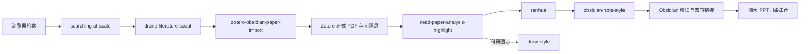

# Unified-Scholarflow-Skills

**多 Agent 通用**的科研检索、文献管理、精读笔记、科研绘图与 Skill 治理工作流。

Agent-agnostic research skills for literature discovery, reading notes, scientific figures, and skill governance.

**版本 v1.1** · 姊妹仓库：[academic-native-ppt-design-HNU-style](https://github.com/w5711112/academic-native-ppt-design-HNU-style)

---

## 1. 解决什么问题

科研时间大量耗在**环节交接**上。本仓库把反复出现的操作写成**可执行规则**，由 Agent **按固定步骤自动推进**，每一步都有明确的**输入、输出和核对条件**。

| 常见卡点 | 体系化对应能力 |
| --- | --- |
| 论文搜到了，版本、PDF、归档还要再查 | **searching-at-scale** → **drone-literature-scout** → **zotero-obsidian-paper-import** 自动串联 |
| 读完了，依据散在浏览器和几个软件里 | **read-paper-analysis-highlight** 自动精读并锚定证据，**obsidian-note-style** 自动归并知识 |
| 笔记语气生硬、事实被改写 | **renhua** 按规则自动检视表达 |
| 组会图不统一、版式不稳 | 姊妹仓 **academic-native-ppt-design-HNU-style** 自动排版 + 门禁 |
| 同类故障反复踩、Skill 难维护 | **collect-bug-update-accelerate** 与 **skill-ecosystem-governor** 自动登记与同步 |

使用前请按自己的方向补**检索主题、来源范围、路径和写作偏好**。默认配置带有维护者的个人习惯，克隆后可以改。

---

## 2. 整套体系一张图


> **图 1 · 全体系协作地图（原图，同时展示 draw-style 的成图风格）。**
> 左侧是**写作与生态治理**，右侧是**检索 → 筛选 → 导入 → 精读 → 组织 → 绘图**的研究主链。治理侧自动维护规则、发布与故障复用；研究侧自动衔接论文来源核验、可靠性判断、内容提取与知识复用。

---

## 3. 核心链路（体系自动串联）



> **链路含义：** 先自动确认**是哪一篇、版本可不可信**（正式期刊/会议版本优先），再**自动读全文取证据**，然后按规则**理顺中文表达**，最后**自动写入可检索的知识网络**。绘图与汇报是并行出口。

---

## 4. 重点效果

### 4.1 论文精读与 Zotero–Obsidian 双向联动

**体系化目标：** 从「一篇论文」到「可复用知识」全程由 Skill 串联，减少手工拷贝和漏归档。

**zotero-obsidian-paper-import** 在导入阶段**自动**完成：

- **自动**核对 DOI 与正式出版身份，**优先从期刊 / 会议等正式来源**取得正确文献版本与合法 PDF，而不是把 arXiv 预印本或搜索摘要当成最终版本；
- **自动**写入 Zotero 父条目与存储附件，并回填 Obsidian 入口；
- **自动**去重、合并重复条目，并做写后对账。

**read-paper-analysis-highlight** 在精读阶段**自动**完成：

- **自动**逐页阅读 PDF 正文、公式与图表；
- **自动**提炼问题、方法、技术路线、证据与局限；
- **自动**生成 Zotero 原生高亮与 Obsidian 精读结构。

**双向跳转（体系化联动）：**

- **从笔记的论文链接能直接跳到文献管理软件 Zotero 中对应论文 PDF 的对应位置；**
- **从 Zotero 中点击相应跳转区域，也能返回笔记软件 Obsidian 的对应位置。**


> **图 2 · read-paper-analysis-highlight + zotero-obsidian-paper-import 双向联动总览（重点图）。**
> 左侧是论文 PDF 与自动批注，右侧是 Obsidian 笔记层级与跳转。**自动**形成「正式 PDF + 元信息 + 原生高亮 + 结构化笔记」同一条证据链，便于按问题、方法、技术路线、证据、局限复用。


> **图 3 · zotero-obsidian-paper-import：** **自动**写入的论文链接，使从 Obsidian 点击后**直接跳到 Zotero 中对应论文 PDF 的对应位置**。


> **图 4 · zotero-obsidian-paper-import：** **自动**回填的跳转区域，使从 Zotero 点击后**返回 Obsidian 笔记的对应位置**。

**精读自动抓取的内容（read-paper-analysis-highlight）**

- **自动**覆盖正文、公式、图；
- **自动**写清作者解决的问题与证据范围；
- **自动**把结论锚到原文位置，便于复查与顺参考文献追溯。


> **图 5 · read-paper-analysis-highlight：** 导入前核对论文身份与 PDF，**以此保证论文导入来源正确**。


> **图 6 · read-paper-analysis-highlight：** **自动**对下载下来的论文 PDF 的关键引用单独标注，便于追溯奠基论文。


> **图 7 · read-paper-analysis-highlight：** 标题顶部**自动**加一段通俗总览，通过直接总结 PDF 论文获得，目的是直观了解论文的方法实现。图中仅对论文标题局部打码，作者与期刊信息保留。

---

### 4.2 知识组织（obsidian-note-style）

读完之后，**obsidian-note-style 自动**把内容放进可检索、可展开的笔记体系：统一层级、折叠结构、高亮语义与双向链接。


> **图 8 · obsidian-note-style：** **自动**按问题 / 方法 / 证据分层组织笔记，支持折叠展开；正文保持可编辑，便于后续修订。


> **图 9 · obsidian-note-style：** **自动**用颜色标注来区分不同的重点内容，并且**自动**加入跳转双向链接来归并知识点。**自动**生成的适当高亮可以突出不同层面的技术路径等。


> **图 10 · obsidian-note-style：** **自动**建立概念之间的双向链接网络，从一篇论文可以走到相关方法与前置知识，形成体系化知识图。

---

### 4.3 科研绘图（draw-style）

**draw-style** 按证据类型**自动**推荐图型（比较 / 层次 / 流程 / 分布），再约束颜色语义、线型、字号与图例，最后做成图检查。


> **图 11 · draw-style：** **自动**约束的方法/对比类示意图，线型与颜色承担固定语义，避免同一含义换图就换编码。


> **图 12 · draw-style：** 换版式时**自动**保持语义编码不变，保证多图之间仍可对照阅读。


> **图 13 · draw-style：** **自动**把学习顺序与知识点依赖画成层次，服务「先学什么、再学什么」的体系化理解。

---

### 4.4 广域检索（searching-at-scale）

**searching-at-scale** **自动**做跨站点检索，**自动**记录发现与筛选轨迹、耗时与来源证据，便于复盘覆盖率与缺口。


> **图 14 · searching-at-scale：** **自动**记录的一次调研「发现—筛选」过程。调研主题关键字已遮盖；**结构、来源链、耗时**保留，用于说明轨迹如何被体系化记录。

文献能否进入研究证据链，由 **drone-literature-scout** **自动**按正式来源与发表渠道质量分层筛选。示例主题使用无人机方向说明流程。

---

### 4.5 故障复用（collect-bug-update-accelerate）

**collect-bug-update-accelerate** **自动**把真实技术故障记成事件并归入问题族，已验证处理路线可复用，避免同类问题反复手工排查。


> **图 15 · collect-bug-update-accelerate：** 运行过程中**自动**留下可复用的问题记录与修复线索。

---

### 4.6 学术 PPT（姊妹仓）

演示文稿由 **academic-native-ppt-design-HNU-style** **自动**按湖大版式规则排版，并用门禁脚本检查字阶与出框。本页只放三张预览。

| 封面感 | 中间页 | 收束感 |
| --- | --- | --- |
|  |  |  |

> **图 16 · academic-native-ppt-design-HNU-style 预览。** **自动**套用母版、字阶与印章禁飞区规则。完整 10 张大图见 [academic-native-ppt-design-HNU-style](https://github.com/w5711112/academic-native-ppt-design-HNU-style)。

---

## 5. 为什么做成 Skill / Plugin

一次问答通常以一段文字结束。科研任务还要**读文件、调浏览器和 Zotero、写笔记**，并留下可检查的结果。

写成 **Skill** 后，Agent **按固定输入输出自动推进**，在需要判断处停下来；**Plugin** 把常一起使用的 Skill、脚本和配置装成一个包，**体系化**配合，而不是每次从提示词重新拼装。

---

## 6. 几条有代表性的规则

完整条文在各 `SKILL.md` 与 `references/`。

### renhua：中文怎样写清楚

- **破折号（——）和分号基本不用。** 能并成一句就并，该断开就改句号。
- **长句短句错开。** 连续好几句长度接近时拆一句或并一句。
- **只改说法，不改事实。** 人名、数字、时间、术语、引语、**限定词**和论断强度前后一致。
- **去掉空话。** 「综上所述」「必将大放异彩」这类句子去掉或落回具体事实；有依据的「应 / 须 / 严禁」保留原力度。

### read-paper / zotero-import：自动钉死「是哪一篇」

- **自动**核对标题、作者、DOI、正式版本；**正式期刊/会议版本优先**，而不是直接采用 arXiv 预印本。
- **PDF 自动打开核验。** 页数、图表、公式位置与文件一致才继续写入。
- 结论**自动**标注原文位置。

### searching-at-scale / Edge 桥

- 扩展权限限制在**检索相关站点**，不启用远程调试接口，不模拟键鼠。
- **专用 profile** 与**独立管道**和日常 Edge 分开运行。
- **`edge_bridge_ctl.py` 自动**安装 Native Host、启动 Edge、探测管道。Codex、Claude Code、Kimi、MiMo Desktop 使用同一命令。

### draw-style：图服务证据

- **自动**判定这张图证明比较、层次、流程还是分布。
- 同一含义**自动**复用同一套颜色、线型和图例。
- 字号和留白按**投影可读性**设置。

### HNU PPT（姊妹仓）：版式自动稳定

- **先选版式再自动填内容。** 大图页、对照页、高密要点页各有原型。
- **行距和字阶有固定档位。** 正文常用 **16–18 pt**，高密页 **13–14.5 pt** 并配合分栏，行距大约 **18–20 pt**。
- **左下角印章区域自动留空**，卡片避开水印。
- **`audit_hnu_deck.py` 自动**检查字号下限、出框和误粘贴的 Markdown 符号。

---

## 7. 仓库结构

```text
Unified-Scholarflow-Skills/
├─ plugins/
│  ├─ skill-governance-plugin/
│  │  └─ skills/
│  │     ├─ collect-bug-update-accelerate/   # 故障事件、问题族、已验证方案复用
│  │     ├─ github-upload/                   # 去隐私公开包、README、发布确认
│  │     ├─ migration-skill/                 # 跨宿主迁移与能力差异核对
│  │     ├─ skill-ecosystem-governor/        # 注册表、依赖、版本与同步
│  │     └─ workspace-hygiene/               # 工作区体积、旧版本、可恢复清理
│  └─ drone-literature-scout-plugin/
│     ├─ integrations/
│     │  └─ zotero-local-bridge/             # Zotero 本地桥接扩展
│     └─ skills/
│        ├─ draw-style/                      # 方法图 / 知识点图 / 数据图
│        ├─ drone-literature-scout/          # 文献发现、核验、质量分层
│        ├─ obsidian-note-style/             # 笔记层级、折叠、双链、配色
│        ├─ read-paper-analysis-highlight/   # 全文精读、证据锚点、原生高亮
│        ├─ searching-at-scale/              # 广域检索、Edge 桥、轨迹统计
│        │  ├─ edge-extension/               # Edge MV3 扩展
│        │  ├─ native-host/                  # Native Messaging 宿主
│        │  └─ scripts/edge_bridge_ctl.py    # 任意宿主安装/启动/探测
│        └─ zotero-obsidian-paper-import/    # 正式版本核验、Zotero 写入、Obsidian 回链
├─ skills/
│  ├─ renhua/                                # 中文表达闸门
│  │  └─ references/                         # 铁律、R1–R17、执行与交付
│  └─ skill-contract-lock/                   # 多 Skill 要求与证据锁
├─ docs/
│  └─ images/                                # 本页效果图
├─ README.md
├─ LICENSE
├─ SECURITY.md
└─ THIRD_PARTY_NOTICES.md
```

学术 PPT 安装姊妹仓库中的 **academic-native-ppt-design-HNU-style**。

---

## 8. 各 Skill 做什么（具体）

### 8.1 研究主链 · drone-literature-scout-plugin

**searching-at-scale**
**自动**跨站点检索并收集候选，保留**来源 URL、字段出处、覆盖缺口、停止条件**。支持 Edge 扩展投影、Sitemap 发现、Common Crawl 等入口。公开版需自配**关键词与站点范围**。

**drone-literature-scout**
**自动**在候选上做身份核验与质量分层：优先正式来源、高可信发表渠道，输出去重后的可信文献集合和纳入/排除理由。示例主题为无人机方向。

**zotero-obsidian-paper-import**
**自动**核对 DOI 与正式出版身份，**优先期刊/会议正确版本**，取得合法 PDF，写入 Zotero 父条目与存储附件，并回填 Obsidian 可跳转链接。含去重、合并与写后对账。

**read-paper-analysis-highlight**
**自动**逐页读正文、公式、图表，提炼问题、方法、技术路线、证据、局限，生成可编辑 Zotero 原生高亮与 Obsidian 精读笔记，并锚定原文位置。

**obsidian-note-style**
**自动**把已核验内容组织成可折叠、可编辑、可互链的 Obsidian 笔记：知识归属、阅读层次、Callout、公式、图文位置与媒体清理。

**draw-style**
**自动**为论文方法图、知识点图、数据图选型，并约束布局、配色、字体、线型、图例，最后做成图检查。

### 8.2 治理 · skill-governance-plugin

**collect-bug-update-accelerate**
**自动**记录真实技术事件，归入稳定问题族，复用已验证方案。

**github-upload**
**自动**生成去隐私公开副本，补 README 与依赖说明，审计后再进入发布确认。

**migration-skill**
在 Codex、Claude Code、Kimi 等环境之间迁移 Skill，核对工具、路径、调度与运行能力差异。

**skill-ecosystem-governor**
**自动**维护组件注册表、依赖关系、聚合指南与版本一致性，驱动 sync-guides / sync-overview / audit。

**workspace-hygiene**
以预演 + 可恢复方式整理工作区体积、旧版本与可再生产物。

### 8.3 独立 Skill

**renhua**
按规则**检视并改写**简体中文表达：去 AI 腔与失衡姿态，保留术语、证据、限定词与正式程度。

**skill-contract-lock**
多 Skill 协作时锁定原始要求与证据边界，防止摘要或计划替代权威规则。

---

## 9. 多宿主与 Edge 联动

Skill 以标准 **`SKILL.md` + `references/` + `scripts/`** 交付。**Codex、Claude Code、Kimi Code、MiMo Desktop** 都可以加载。

**MiMo Desktop 与 Edge 的联动已经实测通过。** 在 `searching-at-scale` 目录执行：

```powershell
python scripts\edge_bridge_ctl.py status
python scripts\edge_bridge_ctl.py install
$profile = Join-Path $env:TEMP 'mimo-scholarflow\edge-profile'
New-Item -ItemType Directory -Force -Path $profile | Out-Null
python scripts\edge_bridge_ctl.py launch --profile $profile --replace
python scripts\edge_bridge_ctl.py probe --profile $profile --timeout-ms 15000
```

`probe` 返回 **`ok: true`** 时，体系化链路为：**Agent → Edge 扩展 → Native Host → 命名管道**。细节见  
`plugins/drone-literature-scout-plugin/skills/searching-at-scale/references/mimo-edge-integration.md`。

| 宿主 | 加载方式 | Edge |
| --- | --- | --- |
| Codex | Plugin 或技能目录 | 同一 `edge_bridge_ctl.py` |
| Claude Code | `.agents/skills` 等 | 同一命令 |
| Kimi Code | 技能目录 | 同一命令 |
| MiMo Desktop | 对话指定路径或技能目录 | 同一命令（**已验证**） |

---

## 10. 使用前提与安装

**前提**

1. **Agent 宿主**（Codex / Claude Code / Kimi / MiMo Desktop 等）
2. **Edge/Chromium**：安装 `searching-at-scale/edge-extension/`，执行 `edge_bridge_ctl.py install`
3. **Zotero**：Connector，开启本机通信；需要原生批注回链时安装 `integrations/zotero-local-bridge/`
4. **Obsidian**：自己的 Vault 与论文索引，允许 `obsidian://`

常用依赖：**Python 3、Node.js**，以及 **PyMuPDF、pypdf、PyYAML** 等。以各目录 `REQUIREMENTS.md` 与 `package.json` 为准。

**最小闭环：** Obsidian 列出论文 → Agent 经 Edge **自动**核验正式来源 → 合法 PDF **自动**写入 Zotero → **自动**精读并生成原生高亮 → **自动**写回 Obsidian → 两侧互跳。

**安装**

```powershell
git clone https://github.com/w5711112/Unified-Scholarflow-Skills.git
```

- **独立 Skill**：整目录拷到技能路径，例如 `~/.agents/skills/<skill-name>/`。
- **Plugin**：保留整个 `plugins/<plugin-name>/` 再加载。
- **首次运行前**修改配置：路径、主题、来源范围、时间预算、Zotero/Obsidian、扩展位置。
- 治理注册表依赖本机路径，在自己的环境中生成。

---

## 11. 仓库内容与隐私

仓库内容为 **Skill 规则、脚本、配置示例**和**脱敏示意图**。配置使用**占位符路径**与**占位符库 ID**。效果图对**调研关键字**做了遮盖，对**论文标题**做了局部打码。示例主题使用无人机方向说明流程，其他领域替换主题词、来源范围和质量标准即可。

自动下载只针对**出版社、会议、机构仓储**或作者明确提供的合法入口。来源可信范围由使用者按领域配置。

安全问题见 [SECURITY.md](SECURITY.md)。

## Related

- 学术 PPT（湖南大学风格，完整 10 图与规则）：[academic-native-ppt-design-HNU-style](https://github.com/w5711112/academic-native-ppt-design-HNU-style)

## 许可

代码与仓库自有文本按 [LICENSE](LICENSE) 使用。第三方组件见 [THIRD_PARTY_NOTICES.md](THIRD_PARTY_NOTICES.md)。

---

## English summary

**Unified-Scholarflow-Skills v1.1** is an agent-agnostic research workflow: large-scale web discovery, literature vetting (official journal/conference versions first), Zotero–Obsidian import, full-text reading with native highlights, note organization, scientific figures, Chinese prose cleanup (**renhua**), and skill governance.

The pipeline is systematic: skills hand off verified artifacts instead of raw links. Bidirectional links go from an Obsidian paper entry to the matching Zotero PDF location, and from Zotero back into the note.

Hosts include **Codex, Claude Code, Kimi Code, and MiMo Desktop**. Edge integration is verified end-to-end via `scripts/edge_bridge_ctl.py`.

Academic slides: [academic-native-ppt-design-HNU-style](https://github.com/w5711112/academic-native-ppt-design-HNU-style).
